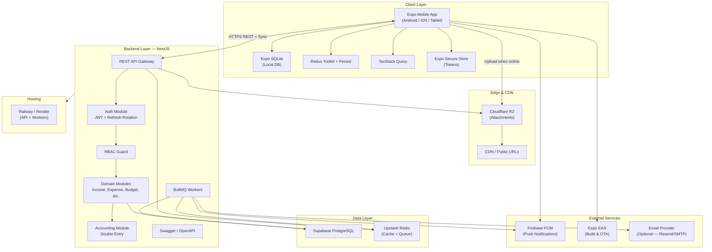
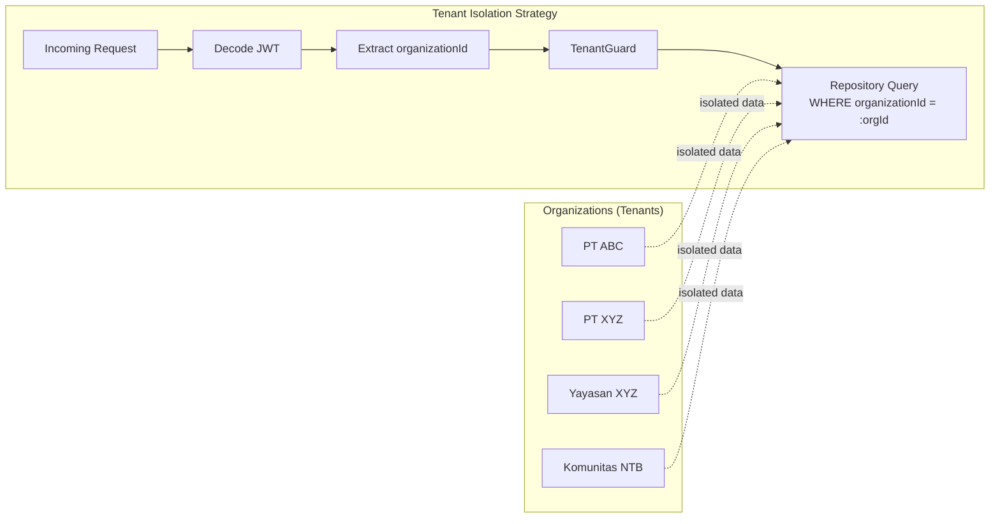
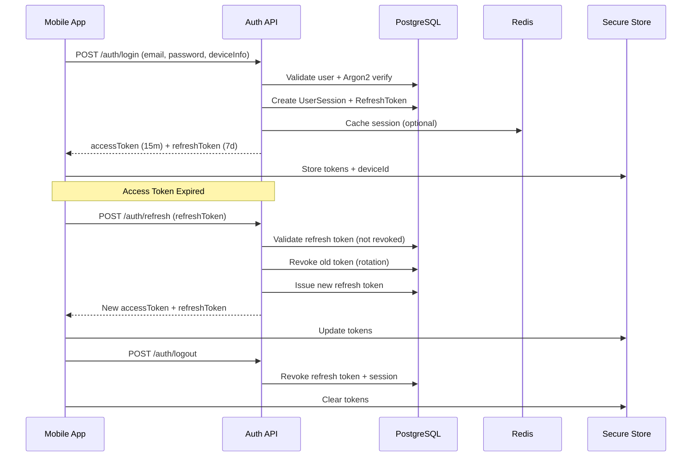
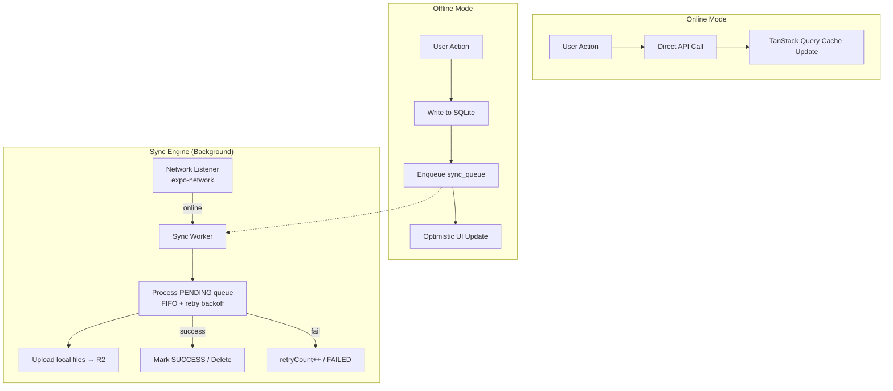
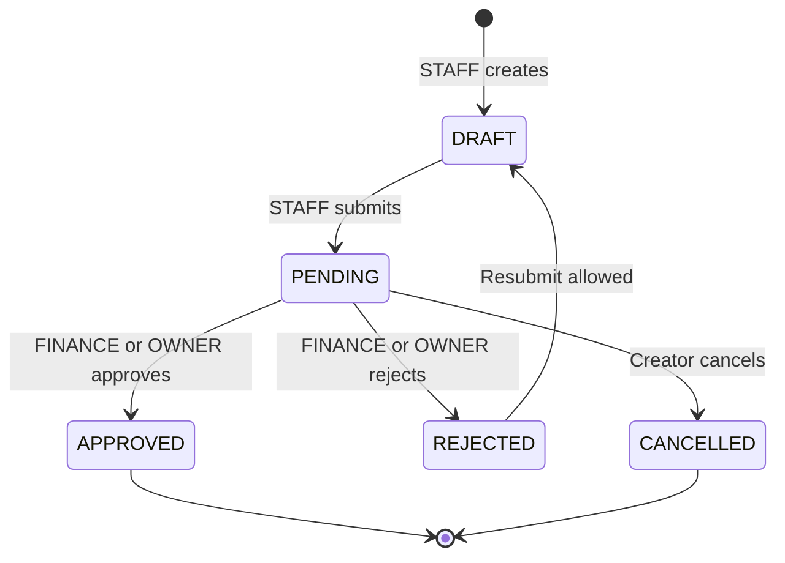
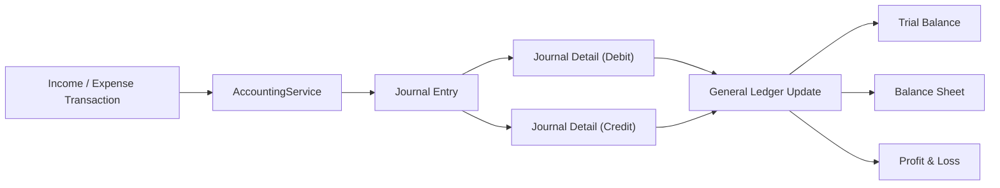
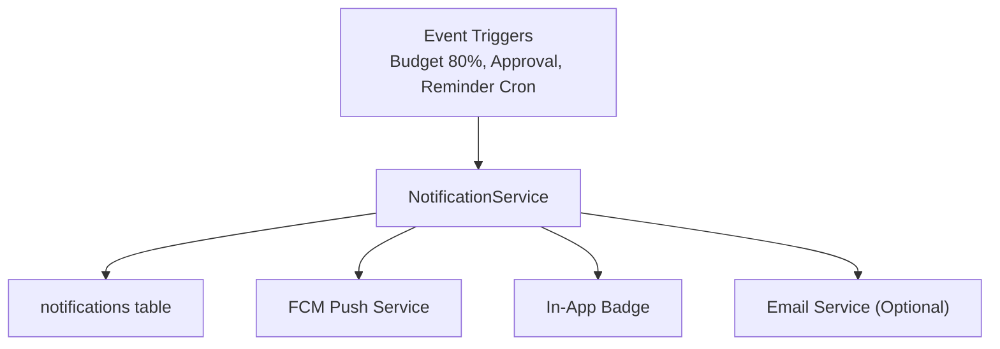
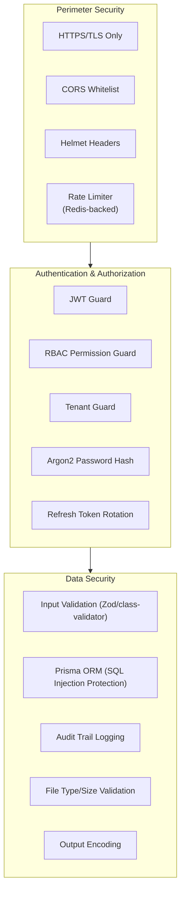
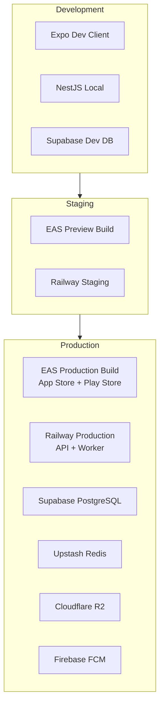

# FMS Enterprise — System Architecture

> Financial Management System | Production-Ready | Multi-Tenant | Offline-First

---

## 1. Executive Summary

FMS adalah platform SaaS enterprise untuk pencatatan, analitik, dan monitoring keuangan organisasi (individu, UMKM, komunitas, yayasan, koperasi, multi-cabang). Sistem dirancang untuk skala puluhan ribu pengguna aktif dengan isolasi data per tenant, offline-first mobile, double-entry accounting, dan approval workflow.

---

## 2. High-Level Architecture



---

## 3. Architecture Layers

### 3.1 Presentation Layer (Mobile)

| Komponen | Teknologi | Tanggung Jawab |
|----------|-----------|----------------|
| Navigation | Expo Router | File-based routing, auth groups, tab layout |
| UI | NativeWind + Reanimated | Design system, dark mode, skeleton, animations |
| State (Client) | Redux Toolkit + Persist | Auth, org context, offline queue, UI prefs |
| State (Server) | TanStack Query | API cache, optimistic updates, invalidation |
| Forms | React Hook Form + Zod | Validasi client-side |
| Local DB | Expo SQLite | Income, expense, categories, notifications, sync_queue |
| Security | Secure Store + Local Auth | Token, device ID, biometric unlock |
| Charts | Victory Native XL | Dashboard analytics |
| Offline | Sync Engine | Queue-based bidirectional sync |

### 3.2 API Layer (NestJS)

| Komponen | Pola | Tanggung Jawab |
|----------|------|----------------|
| Controllers | REST | HTTP endpoints, DTO validation |
| Services | Use Cases | Business logic orchestration |
| Repositories | Repository Pattern | Data access abstraction |
| Guards | JWT + RBAC + Tenant | AuthN, permission, org isolation |
| Interceptors | Audit, Transform | Logging, response shaping |
| Pipes | class-validator | Input sanitization |
| Filters | Exception | Standardized error responses |
| Jobs | BullMQ | Reminders, reports, email, push |

### 3.3 Data Layer

| Store | Purpose |
|-------|---------|
| PostgreSQL (Supabase) | Primary relational store, multi-tenant |
| Redis (Upstash) | Session cache, rate limit, BullMQ |
| Cloudflare R2 | Attachment storage (JPG, PNG, PDF) |
| SQLite (Mobile) | Offline-first local persistence |

---

## 4. Multi-Tenant Architecture



### Prinsip Isolasi

1. **Shared Database, Shared Schema** — Satu database PostgreSQL, kolom `organizationId` di setiap tabel transaksi.
2. **Row-Level Security (RLS)** — Opsional di Supabase untuk defense-in-depth.
3. **Application-Level Guard** — `TenantGuard` + repository base class memaksa filter `organizationId`.
4. **SUPER_ADMIN** — Bypass tenant filter hanya untuk operasi platform-wide (audit, support).

### Tenant Context Flow

```
Request → JwtAuthGuard → TenantGuard → PermissionGuard → Controller → Service → Repository
                ↓              ↓
           userId         organizationId (from JWT claim or header X-Organization-Id)
```

---

## 5. Authentication Architecture



### Token Strategy

| Token | Lifetime | Storage (Mobile) | Claims |
|-------|----------|------------------|--------|
| Access Token | 15 menit | Secure Store (memory cache) | sub, email, orgId, roleId, permissions[] |
| Refresh Token | 7 hari | Secure Store | tokenId, userId, deviceId |

### Biometric Login Flow

```
App Launch → Check Secure Store tokens → Prompt biometric → 
Unlock tokens → Validate/refresh if needed → Navigate to dashboard
```

---

## 6. Offline-First Sync Architecture



### Sync Queue States

```
PENDING → SYNCING → SUCCESS (delete)
                 ↘ FAILED (retry if retryCount < 5)
```

### Conflict Resolution

| Strategi | Aturan |
|----------|--------|
| Last-Write-Wins | Default untuk income/expense |
| Server Authority | Approval status, accounting entries |
| Merge | Budget usedAmount (server recalculates) |

---

## 7. Approval Workflow Architecture



### Role dalam Workflow

| Role | Aksi |
|------|------|
| STAFF | Create (DRAFT), Submit (PENDING) |
| FINANCE | Approve, Reject, Edit before approve |
| OWNER | Final approve, view all |
| AUDITOR | Read-only + history |

---

## 8. Double-Entry Accounting Architecture



### Auto Journal Mapping (Contoh)

| Transaksi | Debit | Credit |
|-----------|-------|--------|
| Income — Penjualan | Cash/Bank (ASSET) | Revenue — Penjualan (REVENUE) |
| Expense — Gaji | Expense — Gaji (EXPENSE) | Cash/Bank (ASSET) |

---

## 9. Notification Architecture



### Reminder Cron Jobs (BullMQ)

| Job | Schedule | Kondisi |
|-----|----------|---------|
| daily-transaction-reminder | 20:00 daily | No transaction today |
| income-7day-reminder | Weekly | No income in 7 days |
| expense-7day-reminder | Weekly | No expense in 7 days |
| budget-warning | On budget update | 80% / 90% / over |
| target-reminder | Daily | Target < 100% near deadline |
| monthly-report-reminder | 1st of month | No report generated |

---

## 10. Security Architecture



### Rate Limiting Tiers

| Endpoint Group | Limit |
|----------------|-------|
| Auth (login, register) | 5 req/min per IP |
| General API | 100 req/min per user |
| Report export | 10 req/hour per org |
| File upload | 20 req/hour per user |

---

## 11. Deployment Architecture



### Environment Matrix

| Service | Dev | Staging | Production |
|---------|-----|---------|------------|
| API | localhost:3000 | Railway staging | Railway prod |
| DB | Supabase dev project | Supabase staging | Supabase prod |
| Redis | Upstash dev | Upstash staging | Upstash prod |
| R2 | Dev bucket | Staging bucket | Prod bucket |
| Mobile | `expo run:android/ios` | EAS internal | EAS store |

---

## 12. Scalability Considerations

| Aspek | Strategi |
|-------|----------|
| Horizontal API scaling | Stateless NestJS instances behind Railway load balancer |
| Database | Connection pooling (PgBouncer via Supabase), indexed `organizationId` |
| Caching | Redis for dashboard aggregates, permission cache |
| File storage | R2 unlimited scale, presigned URLs |
| Background jobs | Separate BullMQ worker process |
| Mobile sync | Batched sync (max 50 items per batch), exponential backoff |
| Read replicas | Supabase read replica when traffic > 10k DAU |

---

## 13. Technology Decision Records (Summary)

| Keputusan | Alasan |
|-----------|--------|
| NestJS + Clean Architecture | Modular, testable, enterprise patterns |
| Prisma ORM | Type-safe, migration-friendly |
| Expo Dev Client (bukan Go) | Native modules: SQLite, biometrics, camera |
| Redux Persist + SQLite | Dual offline persistence strategy |
| BullMQ + Redis | Reliable job scheduling |
| Shared-schema multi-tenant | Cost-effective untuk free tier, scalable dengan RLS |
| Double-entry accounting | Professional financial reporting |

---

## 14. Next Phase

Setelah dokumen ini disetujui, lanjut ke:

- **Fase 1b**: Database ERD Lengkap → `docs/02-database-erd.md`
- **Fase 1c**: Prisma Schema Lengkap → `prisma/schema.prisma`
- **Fase 2**: REST API Endpoints, NestJS Modules, DTOs
- **Fase 3**: Mobile structure, Redux, React Query
- **Fase 4**: Implementation
