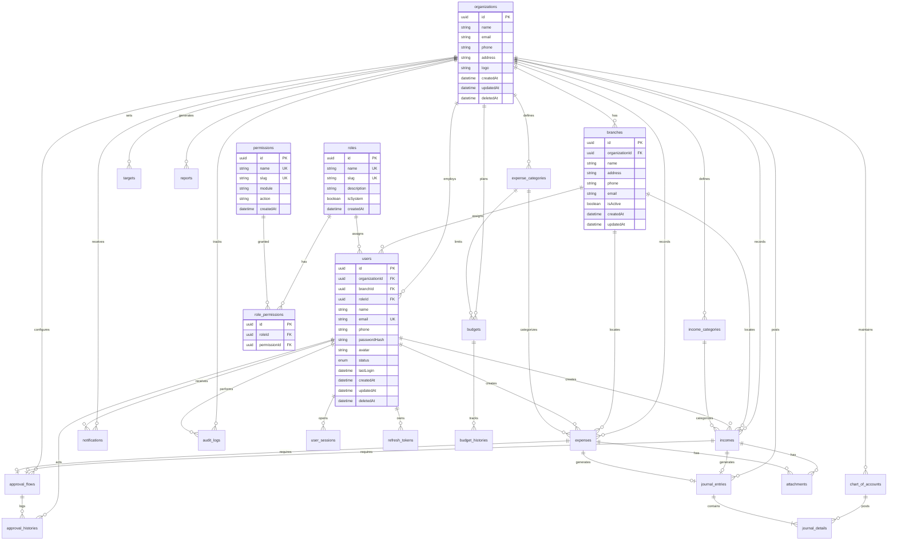
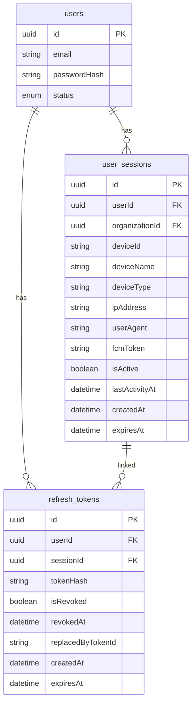
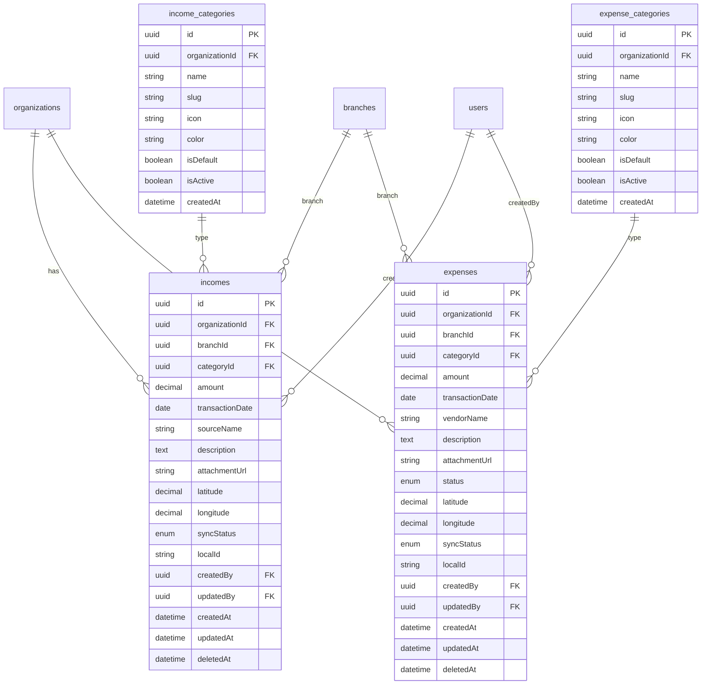
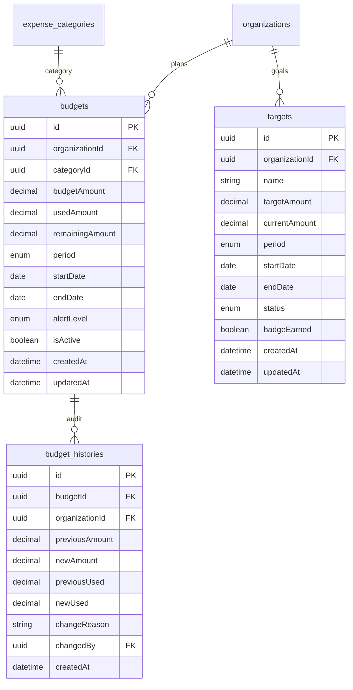
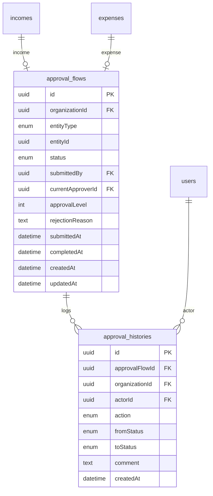
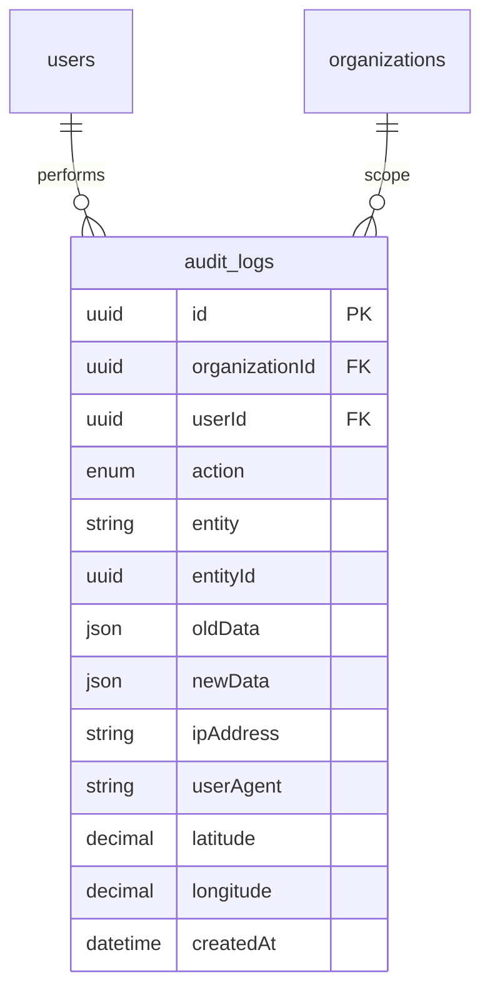
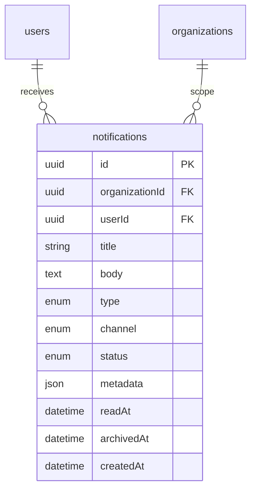
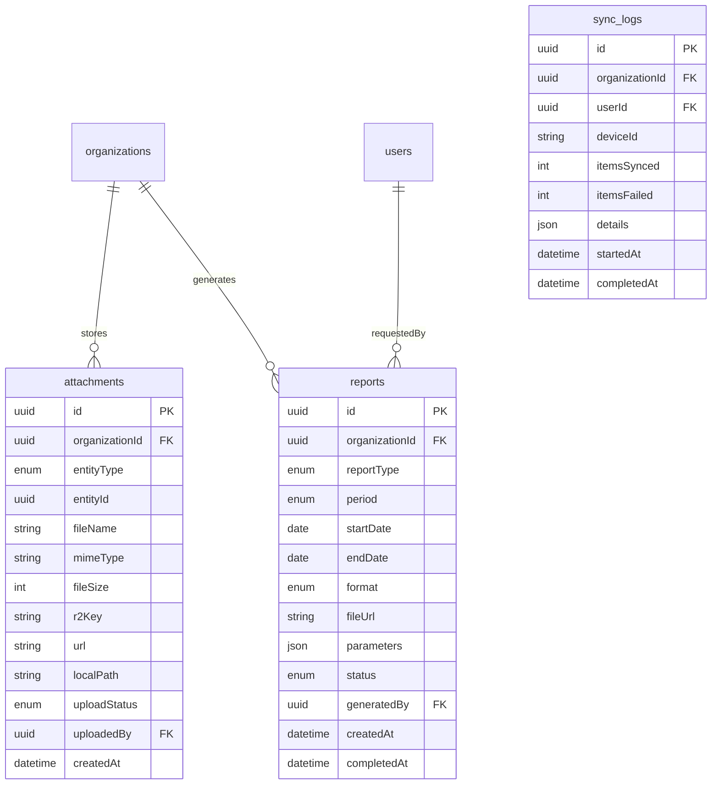
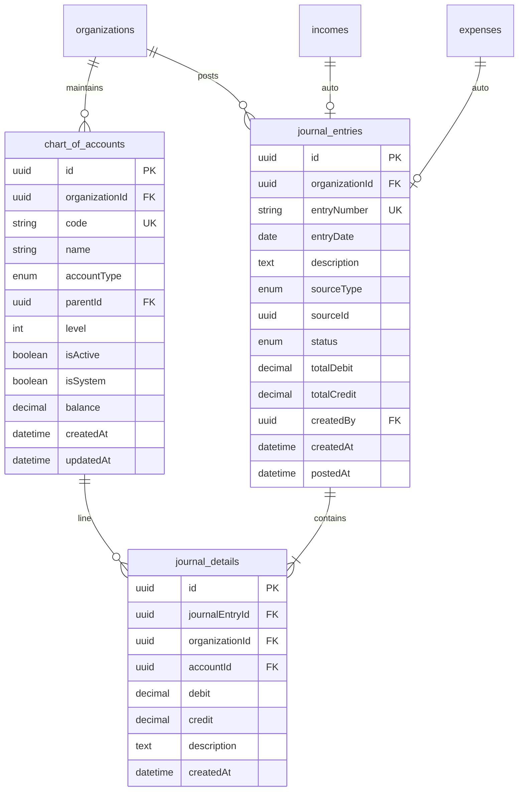
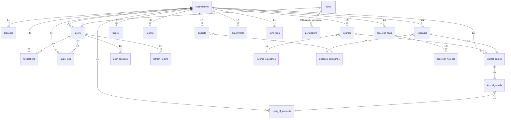

# FMS Enterprise — Database ERD

> Entity Relationship Diagram | PostgreSQL | Multi-Tenant

---

## 1. ERD Overview (Core Domain)

---

## 2. ERD — Authentication & Session

---

## 3. ERD — Financial Transactions

### Default Categories (Seeded per Organization)

**Income**: Penjualan, Jasa, Donasi, Sponsor, Investasi, Hibah, Lainnya

**Expense**: Operasional, Gaji, Marketing, Transportasi, Perjalanan Dinas, Pajak, Aset, Maintenance, Lainnya

---

## 4. ERD — Budget & Financial Target

### Budget Alert Levels

| Level | Threshold |
|-------|-----------|
| NORMAL | < 80% |
| WARNING_80 | ≥ 80% |
| WARNING_90 | ≥ 90% |
| OVER_BUDGET | > 100% |

---

## 5. ERD — Approval System

### Approval Status Enum

`DRAFT` → `PENDING` → `APPROVED` | `REJECTED` | `CANCELLED`

---

## 6. ERD — Audit Trail

### Audit Actions

`LOGIN`, `LOGOUT`, `CREATE`, `UPDATE`, `DELETE`, `EXPORT`, `APPROVE`, `REJECT`, `SYNC`, `UPLOAD`

---

## 7. ERD — Notifications

### Notification Channels

`IN_APP`, `PUSH`, `EMAIL`

### Notification Status

`UNREAD`, `READ`, `ARCHIVED`

---

## 8. ERD — Attachments & Reports

---

## 9. ERD — Double-Entry Accounting

### Account Types

`ASSET`, `LIABILITY`, `EQUITY`, `REVENUE`, `EXPENSE`

### Default Chart of Accounts (Seeded)

| Code | Name | Type |
|------|------|------|
| 1000 | Kas | ASSET |
| 1100 | Bank | ASSET |
| 2000 | Hutang Usaha | LIABILITY |
| 3000 | Modal | EQUITY |
| 4000 | Pendapatan Penjualan | REVENUE |
| 4100 | Pendapatan Jasa | REVENUE |
| 5000 | Beban Operasional | EXPENSE |
| 5100 | Beban Gaji | EXPENSE |

---

## 10. ERD — Complete Relationship Map

---

## 11. Indexing Strategy

| Table | Index | Purpose |
|-------|-------|---------|
| All transaction tables | `(organizationId)` | Tenant filter |
| incomes, expenses | `(organizationId, transactionDate)` | Date range queries |
| incomes, expenses | `(organizationId, branchId)` | Branch filter |
| incomes, expenses | `(organizationId, categoryId)` | Category analytics |
| audit_logs | `(organizationId, createdAt DESC)` | Audit timeline |
| notifications | `(userId, status)` | Unread count |
| journal_entries | `(organizationId, entryDate)` | GL reports |
| chart_of_accounts | `(organizationId, code)` UNIQUE | Account lookup |
| refresh_tokens | `(tokenHash)` | Token validation |
| user_sessions | `(userId, isActive)` | Session management |

---

## 12. Soft Delete Strategy

Tabel dengan `deletedAt` (soft delete):

- `organizations`
- `users`
- `incomes`
- `expenses`

Tabel tanpa soft delete (immutable / audit):

- `audit_logs`
- `approval_histories`
- `budget_histories`
- `journal_entries` (void via reversing entry, not delete)

---

## 13. Mobile SQLite Schema (Offline Mirror)

Tabel lokal di Expo SQLite (subset server):

| Table | Sync Direction |
|-------|----------------|
| `income` | Bidirectional |
| `expense` | Bidirectional |
| `income_category` | Server → Client |
| `expense_category` | Server → Client |
| `notification` | Server → Client |
| `sync_queue` | Client only |

`sync_queue` tidak ada di PostgreSQL server — hanya client-side.

---

## 14. Data Volume Estimates (10k Active Users)

| Table | Est. Rows/Year | Growth |
|-------|----------------|--------|
| incomes | 2M | Linear per transaction |
| expenses | 3M | Linear per transaction |
| journal_details | 10M | 2x per transaction |
| audit_logs | 5M | Per action |
| notifications | 1M | Per event |

Partitioning recommendation at scale: `audit_logs`, `journal_entries` by `createdAt` (monthly).
