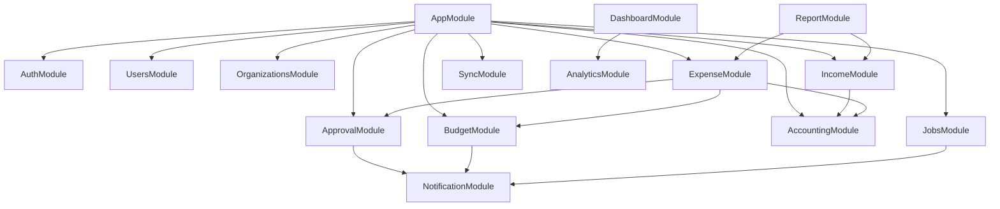

# FMS Enterprise — Folder Structure

> Backend (NestJS) + Mobile (Expo) | Monorepo Layout

---

## 1. Root Monorepo

```
APLIKASI-KEUANGAN/
├── apps/
│   ├── api/                    # NestJS Backend
│   └── mobile/                 # Expo Mobile App
├── packages/
│   └── shared/                 # Shared types, constants, validators (optional)
├── prisma/
│   ├── schema.prisma
│   ├── seed.ts
│   └── migrations/
├── docs/
├── docker/
│   ├── docker-compose.yml      # Local dev: PostgreSQL + Redis
│   └── Dockerfile.api
├── .github/
│   └── workflows/
│       ├── api-ci.yml
│       └── mobile-eas.yml
├── package.json                # Workspace root (npm/pnpm workspaces)
├── turbo.json                  # Optional: Turborepo
└── README.md
```

---

## 2. Backend — `apps/api/`

```
apps/api/
├── src/
│   ├── main.ts
│   ├── app.module.ts
│   │
│   ├── config/
│   │   ├── app.config.ts
│   │   ├── database.config.ts
│   │   ├── jwt.config.ts
│   │   ├── redis.config.ts
│   │   ├── r2.config.ts
│   │   ├── fcm.config.ts
│   │   └── swagger.config.ts
│   │
│   ├── database/
│   │   ├── prisma.module.ts
│   │   ├── prisma.service.ts
│   │   └── transaction.helper.ts
│   │
│   ├── common/
│   │   ├── decorators/
│   │   │   ├── current-user.decorator.ts
│   │   │   ├── current-org.decorator.ts
│   │   │   ├── permissions.decorator.ts
│   │   │   └── public.decorator.ts
│   │   ├── guards/
│   │   │   ├── jwt-auth.guard.ts
│   │   │   ├── refresh-auth.guard.ts
│   │   │   ├── tenant.guard.ts
│   │   │   ├── permissions.guard.ts
│   │   │   └── throttle.guard.ts
│   │   ├── interceptors/
│   │   │   ├── audit.interceptor.ts
│   │   │   ├── transform.interceptor.ts
│   │   │   └── timeout.interceptor.ts
│   │   ├── filters/
│   │   │   └── http-exception.filter.ts
│   │   ├── pipes/
│   │   │   └── validation.pipe.ts
│   │   ├── dto/
│   │   │   ├── pagination.dto.ts
│   │   │   ├── date-range.dto.ts
│   │   │   └── api-response.dto.ts
│   │   ├── interfaces/
│   │   │   ├── repository.interface.ts
│   │   │   ├── paginated-result.interface.ts
│   │   │   └── jwt-payload.interface.ts
│   │   ├── enums/
│   │   │   └── index.ts
│   │   ├── constants/
│   │   │   ├── permissions.constant.ts
│   │   │   └── roles.constant.ts
│   │   └── utils/
│   │       ├── hash.util.ts
│   │       ├── pagination.util.ts
│   │       └── date.util.ts
│   │
│   ├── modules/
│   │   ├── auth/
│   │   │   ├── auth.module.ts
│   │   │   ├── auth.controller.ts
│   │   │   ├── auth.service.ts
│   │   │   ├── strategies/
│   │   │   │   ├── jwt.strategy.ts
│   │   │   │   └── refresh.strategy.ts
│   │   │   ├── dto/
│   │   │   │   ├── register.dto.ts
│   │   │   │   ├── login.dto.ts
│   │   │   │   ├── refresh-token.dto.ts
│   │   │   │   ├── forgot-password.dto.ts
│   │   │   │   ├── reset-password.dto.ts
│   │   │   │   ├── change-password.dto.ts
│   │   │   │   └── device-info.dto.ts
│   │   │   └── repositories/
│   │   │       ├── session.repository.ts
│   │   │       └── refresh-token.repository.ts
│   │   │
│   │   ├── users/
│   │   │   ├── users.module.ts
│   │   │   ├── users.controller.ts
│   │   │   ├── users.service.ts
│   │   │   ├── dto/
│   │   │   │   ├── create-user.dto.ts
│   │   │   │   ├── update-user.dto.ts
│   │   │   │   ├── update-profile.dto.ts
│   │   │   │   └── user-query.dto.ts
│   │   │   └── repositories/
│   │   │       └── user.repository.ts
│   │   │
│   │   ├── organizations/
│   │   │   ├── organizations.module.ts
│   │   │   ├── organizations.controller.ts
│   │   │   ├── organizations.service.ts
│   │   │   ├── dto/
│   │   │   └── repositories/
│   │   │       └── organization.repository.ts
│   │   │
│   │   ├── branches/
│   │   │   ├── branches.module.ts
│   │   │   ├── branches.controller.ts
│   │   │   ├── branches.service.ts
│   │   │   ├── dto/
│   │   │   └── repositories/
│   │   │       └── branch.repository.ts
│   │   │
│   │   ├── roles/
│   │   │   ├── roles.module.ts
│   │   │   ├── roles.controller.ts
│   │   │   ├── roles.service.ts
│   │   │   └── repositories/
│   │   │       └── role.repository.ts
│   │   │
│   │   ├── permissions/
│   │   │   ├── permissions.module.ts
│   │   │   └── permissions.service.ts
│   │   │
│   │   ├── income/
│   │   │   ├── income.module.ts
│   │   │   ├── income.controller.ts
│   │   │   ├── income.service.ts
│   │   │   ├── income-category.controller.ts
│   │   │   ├── dto/
│   │   │   │   ├── create-income.dto.ts
│   │   │   │   ├── update-income.dto.ts
│   │   │   │   ├── income-query.dto.ts
│   │   │   │   └── sync-income.dto.ts
│   │   │   └── repositories/
│   │   │       ├── income.repository.ts
│   │   │       └── income-category.repository.ts
│   │   │
│   │   ├── expense/
│   │   │   ├── expense.module.ts
│   │   │   ├── expense.controller.ts
│   │   │   ├── expense.service.ts
│   │   │   ├── expense-category.controller.ts
│   │   │   ├── dto/
│   │   │   └── repositories/
│   │   │       ├── expense.repository.ts
│   │   │       └── expense-category.repository.ts
│   │   │
│   │   ├── budget/
│   │   │   ├── budget.module.ts
│   │   │   ├── budget.controller.ts
│   │   │   ├── budget.service.ts
│   │   │   ├── dto/
│   │   │   └── repositories/
│   │   │       └── budget.repository.ts
│   │   │
│   │   ├── cashflow/
│   │   │   ├── cashflow.module.ts
│   │   │   ├── cashflow.controller.ts
│   │   │   ├── cashflow.service.ts
│   │   │   └── dto/
│   │   │       └── cashflow-query.dto.ts
│   │   │
│   │   ├── target/
│   │   │   ├── target.module.ts
│   │   │   ├── target.controller.ts
│   │   │   ├── target.service.ts
│   │   │   ├── dto/
│   │   │   └── repositories/
│   │   │       └── target.repository.ts
│   │   │
│   │   ├── approval/
│   │   │   ├── approval.module.ts
│   │   │   ├── approval.controller.ts
│   │   │   ├── approval.service.ts
│   │   │   ├── dto/
│   │   │   │   ├── submit-approval.dto.ts
│   │   │   │   ├── approve-reject.dto.ts
│   │   │   │   └── approval-query.dto.ts
│   │   │   └── repositories/
│   │   │       └── approval.repository.ts
│   │   │
│   │   ├── audit/
│   │   │   ├── audit.module.ts
│   │   │   ├── audit.controller.ts
│   │   │   ├── audit.service.ts
│   │   │   ├── dto/
│   │   │   └── repositories/
│   │   │       └── audit.repository.ts
│   │   │
│   │   ├── notification/
│   │   │   ├── notification.module.ts
│   │   │   ├── notification.controller.ts
│   │   │   ├── notification.service.ts
│   │   │   ├── fcm.service.ts
│   │   │   ├── dto/
│   │   │   └── repositories/
│   │   │       └── notification.repository.ts
│   │   │
│   │   ├── analytics/
│   │   │   ├── analytics.module.ts
│   │   │   ├── analytics.controller.ts
│   │   │   ├── analytics.service.ts
│   │   │   └── dto/
│   │   │       └── analytics-query.dto.ts
│   │   │
│   │   ├── report/
│   │   │   ├── report.module.ts
│   │   │   ├── report.controller.ts
│   │   │   ├── report.service.ts
│   │   │   ├── generators/
│   │   │   │   ├── pdf.generator.ts
│   │   │   │   ├── excel.generator.ts
│   │   │   │   └── csv.generator.ts
│   │   │   ├── dto/
│   │   │   └── repositories/
│   │   │       └── report.repository.ts
│   │   │
│   │   ├── accounting/
│   │   │   ├── accounting.module.ts
│   │   │   ├── chart-of-accounts.controller.ts
│   │   │   ├── journal.controller.ts
│   │   │   ├── accounting.service.ts
│   │   │   ├── journal.service.ts
│   │   │   ├── dto/
│   │   │   │   ├── create-account.dto.ts
│   │   │   │   ├── create-journal.dto.ts
│   │   │   │   └── financial-report-query.dto.ts
│   │   │   └── repositories/
│   │   │       ├── chart-of-account.repository.ts
│   │   │       └── journal.repository.ts
│   │   │
│   │   ├── upload/
│   │   │   ├── upload.module.ts
│   │   │   ├── upload.controller.ts
│   │   │   ├── upload.service.ts
│   │   │   ├── r2.service.ts
│   │   │   └── dto/
│   │   │       └── upload-file.dto.ts
│   │   │
│   │   ├── dashboard/
│   │   │   ├── dashboard.module.ts
│   │   │   ├── dashboard.controller.ts
│   │   │   └── dashboard.service.ts
│   │   │
│   │   └── sync/
│   │       ├── sync.module.ts
│   │       ├── sync.controller.ts
│   │       ├── sync.service.ts
│   │       └── dto/
│   │           ├── sync-push.dto.ts
│   │           └── sync-pull.dto.ts
│   │
│   └── jobs/
│       ├── jobs.module.ts
│       ├── processors/
│       │   ├── reminder.processor.ts
│       │   ├── report.processor.ts
│       │   ├── notification.processor.ts
│       │   └── budget-alert.processor.ts
│       └── schedulers/
│           └── cron.scheduler.ts
│
├── test/
│   ├── e2e/
│   └── unit/
├── nest-cli.json
├── tsconfig.json
├── tsconfig.build.json
├── .env.example
└── package.json
```

---

## 3. Mobile — `apps/mobile/`

```
apps/mobile/
├── app/
│   ├── _layout.tsx                 # Root layout (providers, theme)
│   ├── index.tsx                   # Entry redirect
│   │
│   ├── (auth)/
│   │   ├── _layout.tsx
│   │   ├── login.tsx
│   │   ├── register.tsx
│   │   ├── forgot-password.tsx
│   │   ├── reset-password.tsx
│   │   └── biometric-setup.tsx
│   │
│   ├── (onboarding)/
│   │   ├── _layout.tsx
│   │   ├── welcome.tsx
│   │   └── create-organization.tsx
│   │
│   ├── (tabs)/
│   │   ├── _layout.tsx             # Tab navigator (responsive tablet)
│   │   ├── dashboard/
│   │   │   └── index.tsx
│   │   ├── income/
│   │   │   ├── index.tsx           # List
│   │   │   ├── [id].tsx            # Detail
│   │   │   ├── create.tsx
│   │   │   └── edit/[id].tsx
│   │   ├── expense/
│   │   │   ├── index.tsx
│   │   │   ├── [id].tsx
│   │   │   ├── create.tsx
│   │   │   └── edit/[id].tsx
│   │   ├── more/
│   │   │   ├── index.tsx           # More menu hub
│   │   │   ├── budget/
│   │   │   │   ├── index.tsx
│   │   │   │   ├── create.tsx
│   │   │   │   └── [id].tsx
│   │   │   ├── targets/
│   │   │   │   ├── index.tsx
│   │   │   │   ├── create.tsx
│   │   │   │   └── [id].tsx
│   │   │   ├── cashflow/
│   │   │   │   └── index.tsx
│   │   │   ├── reports/
│   │   │   │   ├── index.tsx
│   │   │   │   └── [id].tsx
│   │   │   ├── analytics/
│   │   │   │   └── index.tsx
│   │   │   ├── accounting/
│   │   │   │   ├── index.tsx
│   │   │   │   ├── chart-of-accounts.tsx
│   │   │   │   ├── journal-entries.tsx
│   │   │   │   ├── trial-balance.tsx
│   │   │   │   ├── balance-sheet.tsx
│   │   │   │   └── profit-loss.tsx
│   │   │   ├── approvals/
│   │   │   │   ├── index.tsx
│   │   │   │   └── [id].tsx
│   │   │   └── audit/
│   │   │       └── index.tsx
│   │   └── settings/
│   │       ├── index.tsx
│   │       ├── profile.tsx
│   │       ├── organization.tsx
│   │       ├── branches/
│   │       │   ├── index.tsx
│   │       │   └── [id].tsx
│   │       ├── users/
│   │       │   ├── index.tsx
│   │       │   └── [id].tsx
│   │       ├── notifications.tsx
│   │       ├── devices.tsx
│   │       ├── security.tsx
│   │       ├── sync-status.tsx
│   │       └── about.tsx
│   │
│   └── +not-found.tsx
│
├── components/
│   ├── ui/                         # Design system primitives
│   │   ├── Button.tsx
│   │   ├── Input.tsx
│   │   ├── Card.tsx
│   │   ├── Badge.tsx
│   │   ├── Avatar.tsx
│   │   ├── Modal.tsx
│   │   ├── Skeleton.tsx
│   │   ├── EmptyState.tsx
│   │   ├── FAB.tsx
│   │   └── ThemeToggle.tsx
│   ├── layout/
│   │   ├── ScreenWrapper.tsx
│   │   ├── Header.tsx
│   │   ├── TabletSidebar.tsx
│   │   └── SafeAreaContainer.tsx
│   ├── forms/
│   │   ├── TransactionForm.tsx
│   │   ├── BudgetForm.tsx
│   │   ├── TargetForm.tsx
│   │   └── AttachmentPicker.tsx
│   ├── charts/
│   │   ├── IncomeTrendChart.tsx
│   │   ├── ExpenseTrendChart.tsx
│   │   ├── CashFlowChart.tsx
│   │   ├── CategoryPieChart.tsx
│   │   └── ProgressRing.tsx
│   ├── dashboard/
│   │   ├── SummaryCard.tsx
│   │   ├── QuickActions.tsx
│   │   ├── RecentTransactions.tsx
│   │   └── HealthScoreCard.tsx
│   ├── transactions/
│   │   ├── TransactionList.tsx
│   │   ├── TransactionItem.tsx
│   │   └── TransactionFilter.tsx
│   └── sync/
│       ├── OfflineBanner.tsx
│       └── SyncIndicator.tsx
│
├── features/                       # Feature-based logic
│   ├── auth/
│   │   ├── hooks/
│   │   └── schemas/
│   ├── income/
│   ├── expense/
│   ├── budget/
│   ├── sync/
│   │   ├── sync-engine.ts
│   │   ├── sync-queue.ts
│   │   └── conflict-resolver.ts
│   └── offline/
│       └── sqlite/
│           ├── database.ts
│           ├── migrations.ts
│           └── repositories/
│               ├── income.local.ts
│               ├── expense.local.ts
│               └── sync-queue.local.ts
│
├── hooks/
│   ├── useAuth.ts
│   ├── useNetwork.ts
│   ├── useBiometric.ts
│   ├── useSync.ts
│   ├── usePermissions.ts
│   ├── useTheme.ts
│   └── useTabletLayout.ts
│
├── services/
│   ├── api/
│   │   ├── client.ts               # Axios instance + interceptors
│   │   ├── auth.api.ts
│   │   ├── income.api.ts
│   │   ├── expense.api.ts
│   │   ├── budget.api.ts
│   │   ├── dashboard.api.ts
│   │   ├── sync.api.ts
│   │   └── index.ts
│   ├── storage/
│   │   ├── secure-storage.ts
│   │   └── file-storage.ts
│   └── notification/
│       ├── push.service.ts
│       └── local-notification.ts
│
├── store/
│   ├── index.ts
│   ├── store.ts
│   ├── hooks.ts
│   ├── persist.config.ts
│   └── slices/
│       ├── auth.slice.ts
│       ├── organization.slice.ts
│       ├── ui.slice.ts
│       ├── sync.slice.ts
│       └── offline.slice.ts
│
├── queries/                        # TanStack Query
│   ├── query-client.ts
│   ├── keys.ts
│   ├── auth.queries.ts
│   ├── dashboard.queries.ts
│   ├── income.queries.ts
│   ├── expense.queries.ts
│   ├── budget.queries.ts
│   ├── analytics.queries.ts
│   └── notifications.queries.ts
│
├── types/
│   ├── api.types.ts
│   ├── auth.types.ts
│   ├── transaction.types.ts
│   ├── sync.types.ts
│   └── navigation.types.ts
│
├── utils/
│   ├── currency.ts
│   ├── date.ts
│   ├── format.ts
│   ├── validation.ts
│   └── permissions.ts
│
├── constants/
│   ├── colors.ts
│   ├── routes.ts
│   ├── permissions.ts
│   └── config.ts
│
├── assets/
│   ├── images/
│   ├── icons/
│   └── fonts/
│
├── app.json
├── eas.json
├── babel.config.js
├── tailwind.config.js
├── metro.config.js
├── tsconfig.json
├── .env.example
└── package.json
```

---

## 4. Shared Package — `packages/shared/` (Optional)

```
packages/shared/
├── src/
│   ├── types/
│   │   ├── income.types.ts
│   │   ├── expense.types.ts
│   │   └── enums.ts
│   ├── constants/
│   │   ├── categories.ts
│   │   └── roles.ts
│   └── validators/
│       ├── income.schema.ts        # Zod schemas shared mobile ↔ API contract
│       └── expense.schema.ts
├── package.json
└── tsconfig.json
```

---

## 5. Naming Conventions

| Area | Convention | Example |
|------|------------|---------|
| NestJS module | `{domain}.module.ts` | `income.module.ts` |
| NestJS controller | `{domain}.controller.ts` | `income.controller.ts` |
| Repository | `{entity}.repository.ts` | `income.repository.ts` |
| DTO | `{action}-{entity}.dto.ts` | `create-income.dto.ts` |
| Mobile screen | kebab route | `app/(tabs)/income/create.tsx` |
| Redux slice | `{domain}.slice.ts` | `auth.slice.ts` |
| Query file | `{domain}.queries.ts` | `income.queries.ts` |
| API service | `{domain}.api.ts` | `income.api.ts` |

---

## 6. Module Dependency Graph (Backend)


