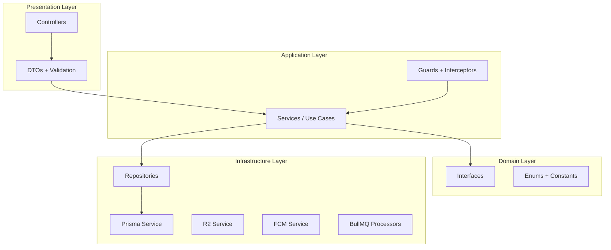

# FMS Enterprise — NestJS Modules, DTO & Repository Pattern

> Clean Architecture | SOLID | Modular

---

## 1. Clean Architecture Layers



### Dependency Rule

- Controllers → Services → Repository Interfaces → Prisma Implementations
- Services TIDAK import Prisma langsung
- Cross-module communication via exported Services, bukan direct repository access

---

## 2. Base Repository Pattern

### Interface — `common/interfaces/repository.interface.ts`

```typescript
export interface PaginatedResult<T> {
  data: T[];
  meta: { page: number; limit: number; total: number; totalPages: number };
}

export interface PaginationOptions {
  page?: number;
  limit?: number;
  sortBy?: string;
  sortOrder?: 'asc' | 'desc';
}

export interface TenantContext {
  organizationId: string;
  userId: string;
  branchId?: string;
  permissions: string[];
}
```

### Abstract Base — `common/repositories/base.repository.ts`

```typescript
export abstract class BaseRepository<T> {
  constructor(protected readonly prisma: PrismaService) {}

  protected tenantWhere(ctx: TenantContext): { organizationId: string } {
    return { organizationId: ctx.organizationId };
  }

  protected paginate(page = 1, limit = 20): { skip: number; take: number } {
    const safePage = Math.max(1, page);
    const safeLimit = Math.min(100, Math.max(1, limit));
    return { skip: (safePage - 1) * safeLimit, take: safeLimit };
  }

  protected buildMeta(total: number, page: number, limit: number) {
    return {
      page,
      limit,
      total,
      totalPages: Math.ceil(total / limit),
    };
  }
}
```

### Example — `income/repositories/income.repository.ts`

```typescript
export interface IIncomeRepository {
  findAll(ctx: TenantContext, query: IncomeQueryDto): Promise<PaginatedResult<Income>>;
  findById(ctx: TenantContext, id: string): Promise<Income | null>;
  findByLocalId(ctx: TenantContext, localId: string): Promise<Income | null>;
  create(ctx: TenantContext, data: CreateIncomeDto): Promise<Income>;
  update(ctx: TenantContext, id: string, data: UpdateIncomeDto): Promise<Income>;
  softDelete(ctx: TenantContext, id: string): Promise<void>;
  sumByPeriod(ctx: TenantContext, start: Date, end: Date, branchId?: string): Promise<Decimal>;
}

@Injectable()
export class IncomeRepository extends BaseRepository<Income> implements IIncomeRepository {
  async findAll(ctx: TenantContext, query: IncomeQueryDto) {
    const { skip, take } = this.paginate(query.page, query.limit);
    const where = {
      ...this.tenantWhere(ctx),
      deletedAt: null,
      ...(query.branchId && { branchId: query.branchId }),
      ...(query.categoryId && { categoryId: query.categoryId }),
      ...(query.startDate && query.endDate && {
        transactionDate: { gte: query.startDate, lte: query.endDate },
      }),
    };
    const [data, total] = await Promise.all([
      this.prisma.income.findMany({ where, skip, take, orderBy: { transactionDate: 'desc' } }),
      this.prisma.income.count({ where }),
    ]);
    return { data, meta: this.buildMeta(total, query.page ?? 1, query.limit ?? 20) };
  }

  async create(ctx: TenantContext, data: CreateIncomeDto) {
    return this.prisma.income.create({
      data: {
        ...data,
        organizationId: ctx.organizationId,
        createdBy: ctx.userId,
      },
    });
  }
  // ... other methods
}
```

---

## 3. Module Specifications

### 3.1 AuthModule

| File | Responsibility |
|------|----------------|
| `auth.controller.ts` | HTTP endpoints auth |
| `auth.service.ts` | Login, register, refresh, password flows |
| `jwt.strategy.ts` | Validate access token |
| `refresh.strategy.ts` | Validate refresh token |
| `session.repository.ts` | CRUD user_sessions |
| `refresh-token.repository.ts` | Token rotation logic |

**AuthService Key Methods:**

```typescript
register(dto: RegisterDto): Promise<AuthResponse>
login(dto: LoginDto): Promise<AuthResponse>
refresh(dto: RefreshTokenDto): Promise<TokenPair>
logout(userId: string, sessionId: string): Promise<void>
forgotPassword(email: string): Promise<void>
resetPassword(dto: ResetPasswordDto): Promise<void>
changePassword(userId: string, dto: ChangePasswordDto): Promise<void>
validateUser(email: string, password: string): Promise<User | null>
rotateRefreshToken(oldToken: string): Promise<TokenPair>
```

---

### 3.2 IncomeModule

**Dependencies:** `AccountingModule`, `AuditModule`, `BudgetModule` (indirect)

**IncomeService Flow (create):**

```
1. Validate category belongs to org
2. Validate branch (if provided)
3. Create income record
4. AccountingService.createJournalFromIncome(income)
5. AuditService.log(CREATE, 'income', income.id)
6. Return income with journal reference
```

---

### 3.3 ExpenseModule

**Dependencies:** `ApprovalModule`, `AccountingModule`, `BudgetModule`

**ExpenseService Flow (create):**

```
1. Validate inputs
2. Create expense with status DRAFT
3. Create ApprovalFlow (linked)
4. AuditService.log(CREATE)
5. Return expense (NO journal until APPROVED)
```

**On Approval:**

```
1. Update expense status → APPROVED
2. AccountingService.createJournalFromExpense(expense)
3. BudgetService.recalculateUsedAmount(categoryId, period)
4. NotificationService.notifyApprovalResult()
```

---

### 3.4 AccountingModule

**AccountingService Key Methods:**

```typescript
createJournalFromIncome(income: Income): Promise<JournalEntry>
createJournalFromExpense(expense: Expense): Promise<JournalEntry>
createManualJournal(dto: CreateJournalDto, ctx: TenantContext): Promise<JournalEntry>
postJournalEntry(id: string, ctx: TenantContext): Promise<JournalEntry>
voidJournalEntry(id: string, ctx: TenantContext): Promise<JournalEntry>
getTrialBalance(ctx: TenantContext, query: FinancialReportQueryDto)
getBalanceSheet(ctx: TenantContext, asOfDate: Date)
getProfitAndLoss(ctx: TenantContext, start: Date, end: Date)
updateAccountBalances(journalEntry: JournalEntry): Promise<void>
```

**Auto Journal Mapping Config:**

```typescript
const INCOME_ACCOUNT_MAP: Record<string, { debit: string; credit: string }> = {
  penjualan: { debit: '1000', credit: '4000' },  // Kas ← Pendapatan Penjualan
  jasa:      { debit: '1000', credit: '4100' },
  donasi:    { debit: '1000', credit: '4200' },
  default:   { debit: '1000', credit: '4000' },
};

const EXPENSE_ACCOUNT_MAP: Record<string, { debit: string; credit: string }> = {
  operasional: { debit: '5000', credit: '1000' },
  gaji:        { debit: '5100', credit: '1000' },
  marketing:   { debit: '5200', credit: '1000' },
  default:     { debit: '5000', credit: '1000' },
};
```

---

### 3.5 SyncModule

```typescript
// sync.service.ts
pushChanges(ctx: TenantContext, dto: SyncPushDto): Promise<SyncPushResult>
pullChanges(ctx: TenantContext, since: Date, entities: string[]): Promise<SyncPullResult>
resolveConflict(ctx: TenantContext, dto: ResolveConflictDto): Promise<void>
```

---

## 4. Complete DTO Catalog

### 4.1 Auth DTOs

#### `RegisterDto`

```typescript
export class RegisterDto {
  @IsString() @MinLength(2) @MaxLength(255)
  name: string;

  @IsEmail()
  email: string;

  @IsString() @MinLength(8) @Matches(/^(?=.*[a-z])(?=.*[A-Z])(?=.*\d)/)
  password: string;

  @IsOptional() @IsString()
  phone?: string;

  @IsString() @MinLength(2)
  organizationName: string;

  @ValidateNested() @Type(() => DeviceInfoDto)
  deviceInfo: DeviceInfoDto;
}
```

#### `LoginDto`

```typescript
export class LoginDto {
  @IsEmail() email: string;
  @IsString() password: string;
  @IsOptional() @IsUUID() organizationId?: string;
  @ValidateNested() @Type(() => DeviceInfoDto) deviceInfo: DeviceInfoDto;
}
```

#### `DeviceInfoDto`

```typescript
export class DeviceInfoDto {
  @IsString() deviceId: string;
  @IsOptional() @IsString() deviceName?: string;
  @IsEnum(DeviceType) deviceType: DeviceType;
  @IsOptional() @IsString() fcmToken?: string;
}
```

#### `RefreshTokenDto`

```typescript
export class RefreshTokenDto {
  @IsString() refreshToken: string;
}
```

#### `ForgotPasswordDto`

```typescript
export class ForgotPasswordDto {
  @IsEmail() email: string;
}
```

#### `ResetPasswordDto`

```typescript
export class ResetPasswordDto {
  @IsString() token: string;
  @IsString() @MinLength(8) newPassword: string;
}
```

#### `ChangePasswordDto`

```typescript
export class ChangePasswordDto {
  @IsString() currentPassword: string;
  @IsString() @MinLength(8) newPassword: string;
}
```

---

### 4.2 User DTOs

#### `CreateUserDto`

```typescript
export class CreateUserDto {
  @IsString() @MinLength(2) name: string;
  @IsEmail() email: string;
  @IsOptional() @IsString() phone?: string;
  @IsUUID() roleId: string;
  @IsOptional() @IsUUID() branchId?: string;
  @IsString() @MinLength(8) password: string;
}
```

#### `UpdateUserDto`

```typescript
export class UpdateUserDto {
  @IsOptional() @IsString() name?: string;
  @IsOptional() @IsString() phone?: string;
  @IsOptional() @IsUUID() roleId?: string;
  @IsOptional() @IsUUID() branchId?: string;
  @IsOptional() @IsEnum(UserStatus) status?: UserStatus;
}
```

#### `UpdateProfileDto`

```typescript
export class UpdateProfileDto {
  @IsOptional() @IsString() name?: string;
  @IsOptional() @IsString() phone?: string;
}
```

---

### 4.3 Organization DTOs

#### `CreateOrganizationDto`

```typescript
export class CreateOrganizationDto {
  @IsString() @MinLength(2) name: string;
  @IsOptional() @IsEmail() email?: string;
  @IsOptional() @IsString() phone?: string;
  @IsOptional() @IsString() address?: string;
}
```

#### `UpdateOrganizationDto`

```typescript
export class UpdateOrganizationDto {
  @IsOptional() @IsString() name?: string;
  @IsOptional() @IsEmail() email?: string;
  @IsOptional() @IsString() phone?: string;
  @IsOptional() @IsString() address?: string;
}
```

---

### 4.4 Branch DTOs

#### `CreateBranchDto` / `UpdateBranchDto`

```typescript
export class CreateBranchDto {
  @IsString() name: string;
  @IsOptional() @IsString() address?: string;
  @IsOptional() @IsString() phone?: string;
  @IsOptional() @IsEmail() email?: string;
}
```

---

### 4.5 Income DTOs

#### `CreateIncomeDto`

```typescript
export class CreateIncomeDto {
  @IsOptional() @IsUUID() branchId?: string;
  @IsUUID() categoryId: string;
  @IsNumber() @IsPositive() amount: number;
  @IsDateString() transactionDate: string;
  @IsOptional() @IsString() sourceName?: string;
  @IsOptional() @IsString() description?: string;
  @IsOptional() @IsString() attachmentUrl?: string;
  @IsOptional() @IsNumber() latitude?: number;
  @IsOptional() @IsNumber() longitude?: number;
  @IsOptional() @IsString() localId?: string;
}
```

#### `UpdateIncomeDto`

```typescript
export class UpdateIncomeDto {
  @IsOptional() @IsUUID() branchId?: string;
  @IsOptional() @IsUUID() categoryId?: string;
  @IsOptional() @IsNumber() @IsPositive() amount?: number;
  @IsOptional() @IsDateString() transactionDate?: string;
  @IsOptional() @IsString() sourceName?: string;
  @IsOptional() @IsString() description?: string;
  @IsOptional() @IsString() attachmentUrl?: string;
}
```

#### `IncomeQueryDto`

```typescript
export class IncomeQueryDto extends PaginationDto {
  @IsOptional() @IsUUID() branchId?: string;
  @IsOptional() @IsUUID() categoryId?: string;
  @IsOptional() @IsDateString() startDate?: string;
  @IsOptional() @IsDateString() endDate?: string;
  @IsOptional() @IsString() search?: string;
}
```

---

### 4.6 Expense DTOs

#### `CreateExpenseDto`

```typescript
export class CreateExpenseDto {
  @IsOptional() @IsUUID() branchId?: string;
  @IsUUID() categoryId: string;
  @IsNumber() @IsPositive() amount: number;
  @IsDateString() transactionDate: string;
  @IsOptional() @IsString() vendorName?: string;
  @IsOptional() @IsString() description?: string;
  @IsOptional() @IsString() attachmentUrl?: string;
  @IsOptional() @IsNumber() latitude?: number;
  @IsOptional() @IsNumber() longitude?: number;
  @IsOptional() @IsString() localId?: string;
}
```

#### `UpdateExpenseDto` — same optional fields as Create

#### `ExpenseQueryDto` — extends PaginationDto + filters (same as Income) + `status`

---

### 4.7 Budget DTOs

#### `CreateBudgetDto`

```typescript
export class CreateBudgetDto {
  @IsUUID() categoryId: string;
  @IsNumber() @IsPositive() budgetAmount: number;
  @IsEnum(BudgetPeriod) period: BudgetPeriod;
  @IsDateString() startDate: string;
  @IsDateString() endDate: string;
}
```

#### `UpdateBudgetDto`

```typescript
export class UpdateBudgetDto {
  @IsOptional() @IsNumber() @IsPositive() budgetAmount?: number;
  @IsOptional() @IsDateString() endDate?: string;
  @IsOptional() @IsString() changeReason?: string;
}
```

---

### 4.8 Target DTOs

#### `CreateTargetDto`

```typescript
export class CreateTargetDto {
  @IsString() name: string;
  @IsNumber() @IsPositive() targetAmount: number;
  @IsEnum(TargetPeriod) period: TargetPeriod;
  @IsDateString() startDate: string;
  @IsDateString() endDate: string;
}
```

#### `ContributeTargetDto`

```typescript
export class ContributeTargetDto {
  @IsNumber() @IsPositive() amount: number;
}
```

---

### 4.9 Approval DTOs

#### `SubmitApprovalDto`

```typescript
export class SubmitApprovalDto {
  @IsEnum(ApprovalEntityType) entityType: ApprovalEntityType;
  @IsUUID() entityId: string;
}
```

#### `ApproveRejectDto`

```typescript
export class ApproveRejectDto {
  @IsOptional() @IsString() @MaxLength(1000) comment?: string;
}
```

---

### 4.10 Accounting DTOs

#### `CreateAccountDto`

```typescript
export class CreateAccountDto {
  @IsString() code: string;
  @IsString() name: string;
  @IsEnum(AccountType) accountType: AccountType;
  @IsOptional() @IsUUID() parentId?: string;
}
```

#### `CreateJournalDto`

```typescript
export class JournalDetailDto {
  @IsUUID() accountId: string;
  @IsNumber() @Min(0) debit: number;
  @IsNumber() @Min(0) credit: number;
  @IsOptional() @IsString() description?: string;
}

export class CreateJournalDto {
  @IsDateString() entryDate: string;
  @IsOptional() @IsString() description?: string;
  @IsArray() @ValidateNested({ each: true }) @Type(() => JournalDetailDto)
  details: JournalDetailDto[];
}
```

#### `FinancialReportQueryDto`

```typescript
export class FinancialReportQueryDto {
  @IsOptional() @IsDateString() startDate?: string;
  @IsOptional() @IsDateString() endDate?: string;
  @IsOptional() @IsDateString() asOfDate?: string;
}
```

---

### 4.11 Report DTOs

#### `GenerateReportDto`

```typescript
export class GenerateReportDto {
  @IsEnum(ReportType) reportType: ReportType;
  @IsEnum(ReportFormat) format: ReportFormat;
  @IsDateString() startDate: string;
  @IsDateString() endDate: string;
  @IsOptional() @IsUUID() branchId?: string;
}
```

---

### 4.12 Sync DTOs

#### `SyncItemDto`

```typescript
export class SyncItemDto {
  @IsString() entityType: string;
  @IsString() entityId: string;
  @IsEnum(['CREATE', 'UPDATE', 'DELETE']) action: string;
  @IsObject() payload: Record<string, unknown>;
  @IsDateString() clientTimestamp: string;
}
```

#### `SyncPushDto`

```typescript
export class SyncPushDto {
  @IsString() deviceId: string;
  @IsArray() @ValidateNested({ each: true }) @Type(() => SyncItemDto)
  items: SyncItemDto[];
}
```

---

### 4.13 Upload DTOs

#### `PresignedUrlDto`

```typescript
export class PresignedUrlDto {
  @IsString() fileName: string;
  @IsString() @IsIn(['image/jpeg', 'image/png', 'application/pdf'])
  mimeType: string;
  @IsNumber() @Max(10485760) fileSize: number; // 10MB max
  @IsEnum(AttachmentEntityType) entityType: AttachmentEntityType;
  @IsUUID() entityId: string;
}
```

---

### 4.14 Common DTOs

#### `PaginationDto`

```typescript
export class PaginationDto {
  @IsOptional() @IsInt() @Min(1) page?: number = 1;
  @IsOptional() @IsInt() @Min(1) @Max(100) limit?: number = 20;
  @IsOptional() @IsString() sortBy?: string;
  @IsOptional() @IsIn(['asc', 'desc']) sortOrder?: 'asc' | 'desc' = 'desc';
}
```

#### `DateRangeDto`

```typescript
export class DateRangeDto {
  @IsDateString() startDate: string;
  @IsDateString() endDate: string;
  @IsOptional() @IsEnum(['DAILY','WEEKLY','MONTHLY','YEARLY','CUSTOM']) period?: string;
}
```

---

## 5. Guards & Decorators Usage

```typescript
@Controller('incomes')
@UseGuards(JwtAuthGuard, TenantGuard, PermissionsGuard)
@ApiBearerAuth()
export class IncomeController {
  @Post()
  @Permissions('income:create')
  create(
    @CurrentUser() user: JwtPayload,
    @CurrentOrg() orgId: string,
    @Body() dto: CreateIncomeDto,
  ) {
    return this.incomeService.create({ organizationId: orgId, userId: user.sub, ... }, dto);
  }
}
```

---

## 6. Repository Catalog

| Repository | Entity | Key Methods |
|------------|--------|-------------|
| `UserRepository` | User | findAll, findByEmail, create, update, softDelete |
| `OrganizationRepository` | Organization | findById, update, seedDefaults |
| `BranchRepository` | Branch | findAll, create, update, deactivate |
| `SessionRepository` | UserSession | create, findActive, revoke, updateActivity |
| `RefreshTokenRepository` | RefreshToken | create, findByHash, revoke, rotate |
| `IncomeRepository` | Income | findAll, create, update, softDelete, sumByPeriod |
| `ExpenseRepository` | Expense | findAll, create, update, softDelete, sumByPeriod |
| `IncomeCategoryRepository` | IncomeCategory | findAll, create, seedDefaults |
| `ExpenseCategoryRepository` | ExpenseCategory | findAll, create, seedDefaults |
| `BudgetRepository` | Budget | findAll, create, update, recalculateUsed |
| `TargetRepository` | Target | findAll, create, update, contribute |
| `ApprovalRepository` | ApprovalFlow | findPending, submit, approve, reject, getHistory |
| `AuditRepository` | AuditLog | create, findAll (read-only) |
| `NotificationRepository` | Notification | create, findByUser, markRead, countUnread |
| `ReportRepository` | Report | create, findAll, updateStatus |
| `ChartOfAccountRepository` | ChartOfAccount | findAll, create, updateBalance |
| `JournalRepository` | JournalEntry | create, post, void, findByPeriod |

---

## 7. Jobs Processors

| Processor | Queue | Trigger | Action |
|-----------|-------|---------|--------|
| `ReminderProcessor` | `reminders` | Cron daily 20:00 | Check no transaction today |
| `IncomeReminderProcessor` | `reminders` | Cron weekly | No income 7 days |
| `ExpenseReminderProcessor` | `reminders` | Cron weekly | No expense 7 days |
| `BudgetAlertProcessor` | `budget-alerts` | On expense approved | Check 80/90/over thresholds |
| `TargetReminderProcessor` | `reminders` | Cron daily | Target near deadline |
| `ReportProcessor` | `reports` | On demand | Generate PDF/Excel/CSV |
| `NotificationProcessor` | `notifications` | Event-driven | Send FCM push |
| `MonthlyReportReminderProcessor` | `reminders` | Cron 1st of month | Remind report generation |
