# FMS Enterprise — Business Flows

> Authentication | Approval | Notification | Offline Sync | Accounting

---

## 1. Authentication Flow

### 1.1 Registration Flow

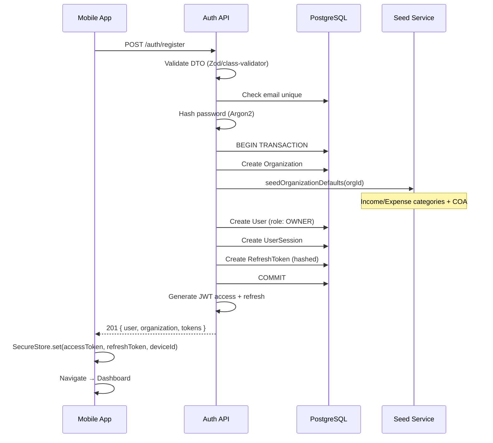

### 1.2 Login Flow

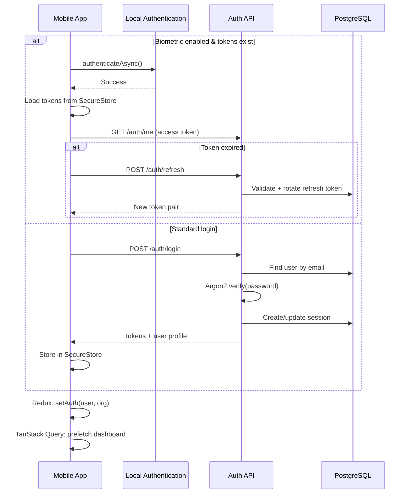

### 1.3 Refresh Token Rotation

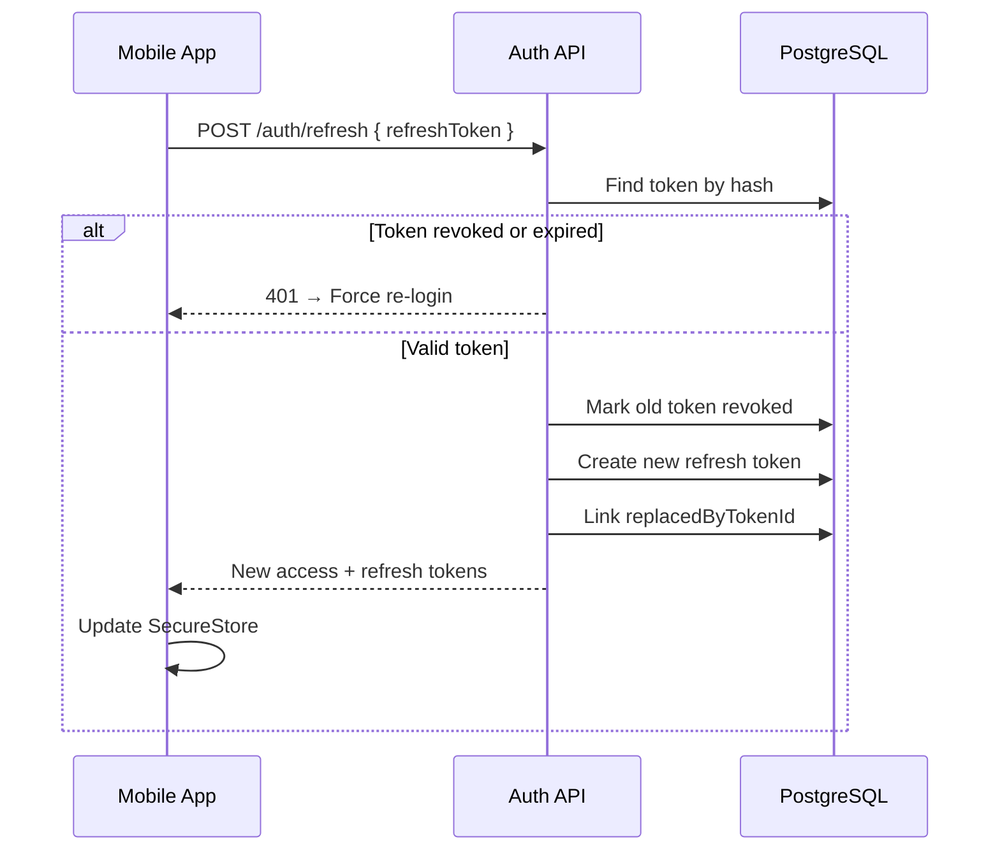

### 1.4 Session & Device Management

| Action | Endpoint | Effect |
|--------|----------|--------|
| View devices | GET `/auth/sessions` | List active sessions |
| Revoke device | DELETE `/auth/sessions/:id` | Revoke refresh tokens for session |
| Logout | POST `/auth/logout` | Revoke current session only |
| Logout all | POST `/auth/logout-all` | Revoke all user sessions |

### 1.5 Forgot / Reset Password

```
User → POST /auth/forgot-password { email }
  → Generate PasswordResetToken (1 hour expiry)
  → Send email with reset link (optional) OR return token in dev
User → POST /auth/reset-password { token, newPassword }
  → Validate token, hash new password
  → Revoke ALL refresh tokens (force re-login)
```

---

## 2. Approval Flow

### 2.1 State Machine

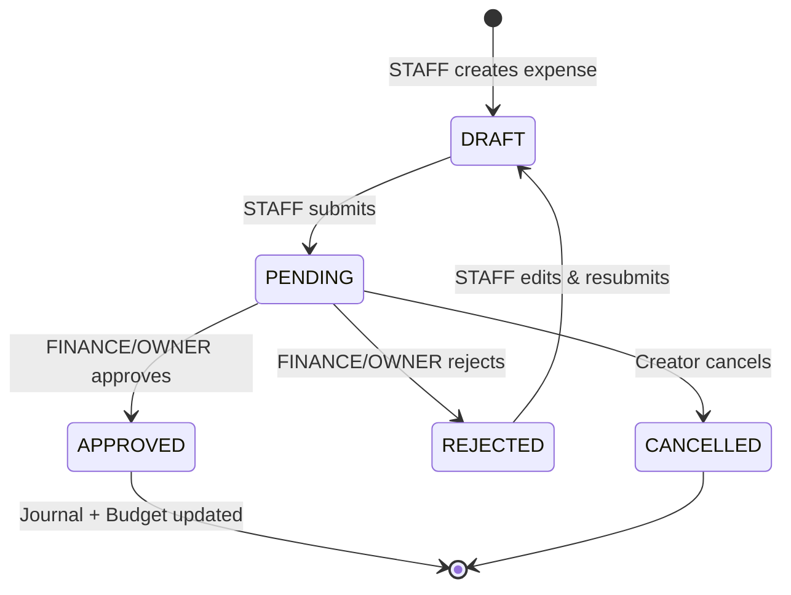

### 2.2 Detailed Sequence

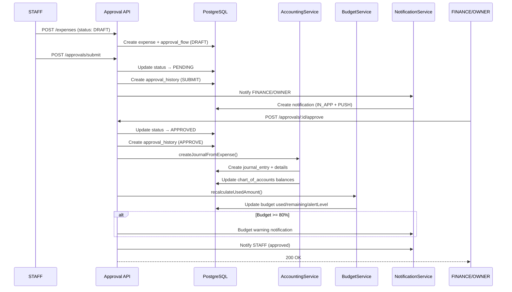

### 2.3 Approval Level Matrix

| Role | Create | Submit | Approve | Reject | View History |
|------|--------|--------|---------|--------|--------------|
| STAFF | ✅ | ✅ | ❌ | ❌ | Own only |
| FINANCE | ✅ | ✅ | ✅ | ✅ | All |
| OWNER | ✅ | ✅ | ✅ | ✅ | All |
| AUDITOR | ❌ | ❌ | ❌ | ❌ | All (read) |

### 2.4 Income vs Expense Approval

| Entity | Approval Required | Default Status |
|--------|-------------------|----------------|
| Income | Optional (org setting) | APPROVED immediately |
| Expense | **Required** | DRAFT → workflow |

---

## 3. Notification Flow

### 3.1 Event-Driven Architecture

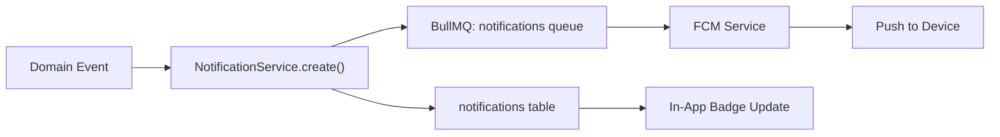

### 3.2 Notification Triggers

| Event | Type | Recipients | Channels |
|-------|------|------------|----------|
| Expense submitted | `APPROVAL_REQUEST` | FINANCE, OWNER | IN_APP, PUSH |
| Expense approved | `APPROVAL_RESULT` | STAFF (creator) | IN_APP, PUSH |
| Expense rejected | `APPROVAL_RESULT` | STAFF (creator) | IN_APP, PUSH |
| Budget 80% | `BUDGET_WARNING` | FINANCE, OWNER | IN_APP, PUSH |
| Budget 90% | `BUDGET_WARNING` | FINANCE, OWNER | IN_APP, PUSH |
| Over budget | `BUDGET_OVER` | FINANCE, OWNER | IN_APP, PUSH |
| Target achieved | `TARGET_ACHIEVED` | All org users | IN_APP, PUSH |
| No transaction today | `TRANSACTION_REMINDER` | STAFF, FINANCE | IN_APP, PUSH |
| Monthly report due | `REPORT_REMINDER` | OWNER, FINANCE | IN_APP, PUSH |

### 3.3 Cron Reminder Flow

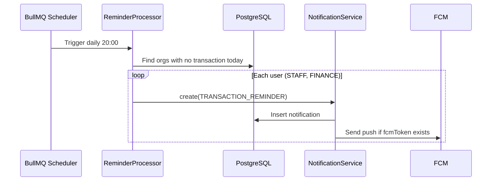

### 3.4 In-App Notification Lifecycle

```
UNREAD → (user opens) → READ → (user archives) → ARCHIVED
```

Mobile polls: `GET /notifications/unread-count` on app foreground.
TanStack Query invalidates on push notification received.

---

## 4. Offline Sync Flow

### 4.1 Architecture Overview

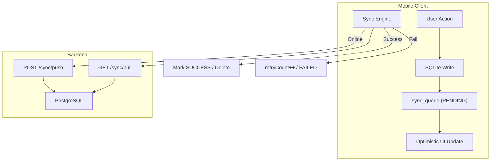

### 4.2 Offline Create Flow

```
1. User creates income offline
2. Generate localId (UUID)
3. INSERT into SQLite income table
4. INSERT into sync_queue:
   { entityType: 'INCOME', entityId: localId, action: 'CREATE', status: 'PENDING', payload: {...} }
5. Redux: add to offline slice
6. UI shows transaction immediately (with "pending sync" badge)
```

### 4.3 Online Sync Flow

```mermaid
sequenceDiagram
    participant Engine as Sync Engine
    participant Queue as sync_queue (SQLite)
    participant API as POST /sync/push
    participant DB as PostgreSQL
    participant Pull as GET /sync/pull

    Engine->>Engine: Network.isConnected() === true
    Engine->>Queue: SELECT * WHERE status=PENDING ORDER BY createdAt ASC LIMIT 50
    loop Each queue item
        Engine->>Queue: UPDATE status=SYNCING
        Engine->>API: Push batch
        API->>DB: Process CREATE/UPDATE/DELETE
        alt Success
            API-->>Engine: { synced: [{ localId, serverId }] }
            Engine->>Queue: DELETE item (SUCCESS)
            Engine->>Engine: Update SQLite with serverId
        alt Fail (retryable)
            API-->>Engine: 409/500
            Engine->>Queue: retryCount++, status=FAILED or PENDING
        end
    end
    Engine->>Pull: GET /sync/pull?since=lastSyncAt
    Pull-->>Engine: Server changes
    Engine->>Engine: Merge into SQLite + invalidate queries
```

### 4.4 File Upload Offline

```
Offline:
  1. Save file to FileSystem.documentDirectory
  2. Store localPath in attachment record
  3. Queue UPLOAD action in sync_queue

Online:
  1. Sync engine detects UPLOAD action
  2. POST /upload/presigned-url
  3. PUT file to R2 presigned URL
  4. POST /upload/confirm
  5. Update entity attachmentUrl with server URL
  6. Delete local file
```

### 4.5 Conflict Resolution Rules

| Scenario | Resolution |
|----------|------------|
| Same record edited offline & server | Last-Write-Wins (compare `updatedAt`) |
| Delete on server, edit offline | Server wins (notify user) |
| Approval status conflict | Server authority always wins |
| Duplicate localId push | Idempotent — return existing server record |
| Budget amounts | Server recalculates from approved expenses |

### 4.6 Sync Queue Schema (SQLite — Mobile Only)

```sql
CREATE TABLE sync_queue (
  id TEXT PRIMARY KEY,
  entity_type TEXT NOT NULL,
  entity_id TEXT NOT NULL,
  action TEXT NOT NULL CHECK(action IN ('CREATE','UPDATE','DELETE','UPLOAD')),
  payload TEXT NOT NULL,
  status TEXT NOT NULL DEFAULT 'PENDING'
    CHECK(status IN ('PENDING','SYNCING','SUCCESS','FAILED')),
  retry_count INTEGER DEFAULT 0,
  error_message TEXT,
  created_at TEXT NOT NULL,
  updated_at TEXT NOT NULL
);
```

---

## 5. Accounting Flow

### 5.1 Double-Entry Principle

```
Every transaction: Total DEBIT = Total CREDIT
```

### 5.2 Income → Journal Entry Flow

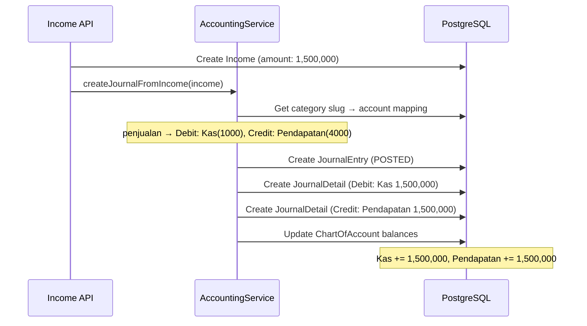

### 5.3 Expense → Journal Entry Flow (On Approval Only)

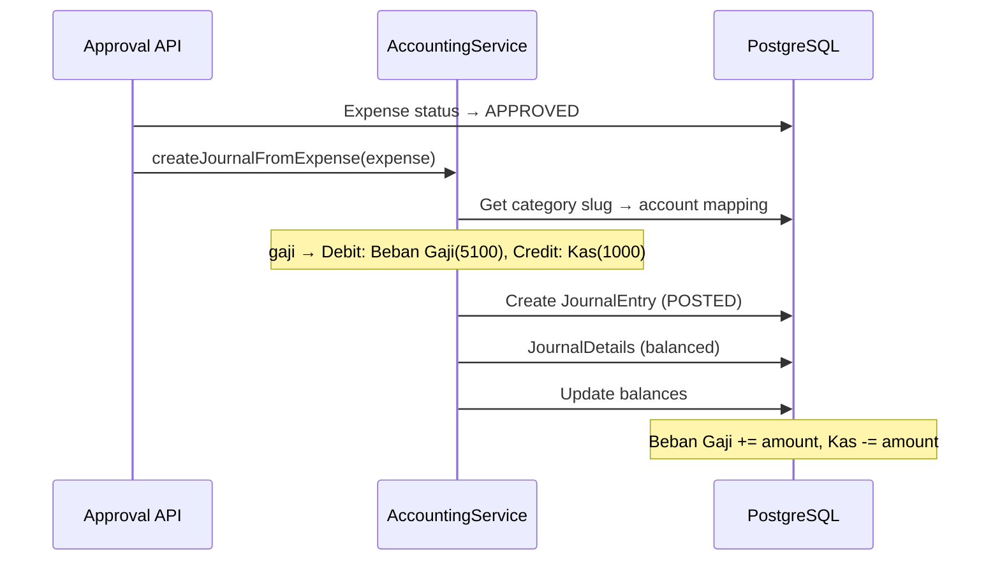

### 5.4 Manual Journal Entry Flow

```
FINANCE → POST /accounting/journal-entries
  → Validate: sum(debit) === sum(credit)
  → Create JournalEntry (DRAFT)
  → POST /accounting/journal-entries/:id/post
  → Status: POSTED, update account balances
```

### 5.5 Void Journal Entry

```
POST /accounting/journal-entries/:id/void
  → Create reversing entry (swap debit/credit)
  → Original entry status → VOIDED
  → Account balances restored
```

### 5.6 Financial Reports Generation

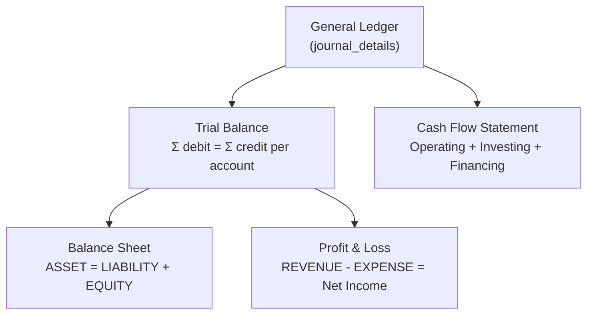

#### Trial Balance Formula

```
For each account: Balance = Σ(debit) - Σ(credit) [for ASSET/EXPENSE]
                  Balance = Σ(credit) - Σ(debit) [for LIABILITY/EQUITY/REVENUE]
```

#### Balance Sheet

```
ASSETS = LIABILITIES + EQUITY
(EQUITY includes retained earnings from P&L)
```

#### Profit & Loss

```
Net Income = Total REVENUE - Total EXPENSE
Period: startDate → endDate
```

### 5.7 Account Balance Update Logic

```typescript
// Pseudocode
function updateBalances(details: JournalDetail[]) {
  for (const detail of details) {
    const account = getAccount(detail.accountId);
    if (['ASSET', 'EXPENSE'].includes(account.accountType)) {
      account.balance += detail.debit - detail.credit;
    } else {
      account.balance += detail.credit - detail.debit;
    }
    save(account);
  }
}
```

---

## 6. Cross-Flow Integration Map

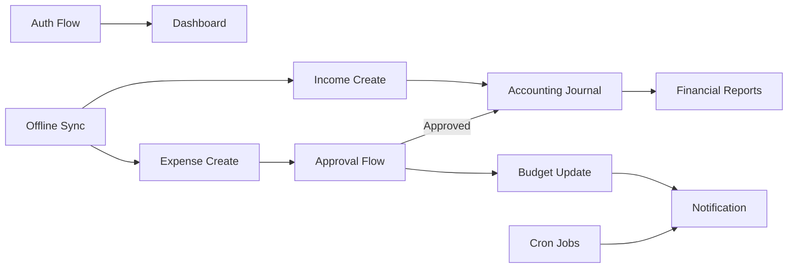
