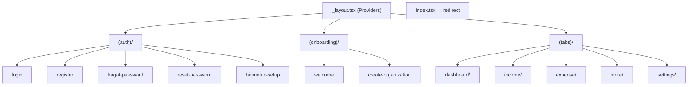

# FMS Enterprise — Mobile Frontend Specification

> Redux Toolkit | TanStack Query | Expo Router | UI Screens | Dashboard Design

---

## 1. Provider Tree (Root Layout)

```tsx
// app/_layout.tsx
<GestureHandlerRootView>
  <ReduxProvider store={store}>
    <PersistGate persistor={persistor}>
      <QueryClientProvider client={queryClient}>
        <ThemeProvider>
          <NetworkProvider>
            <SyncProvider>
              <Slot />  {/* Expo Router */}
            </SyncProvider>
          </NetworkProvider>
        </ThemeProvider>
      </QueryClientProvider>
    </PersistGate>
  </ReduxProvider>
</GestureHandlerRootView>
```

---

## 2. Redux Toolkit Structure

### 2.1 Store Configuration

```typescript
// store/store.ts
export const store = configureStore({
  reducer: {
    auth: authReducer,
    organization: organizationReducer,
    ui: uiReducer,
    sync: syncReducer,
    offline: offlineReducer,
  },
  middleware: (getDefault) =>
    getDefault({ serializableCheck: { ignoredActions: [FLUSH, REHYDRATE, PAUSE, PERSIST, PURGE, REGISTER] } })
      .concat(syncMiddleware),
});
```

### 2.2 Persist Configuration

```typescript
// store/persist.config.ts
const authPersistConfig = {
  key: 'auth',
  storage: AsyncStorage,          // Non-sensitive auth metadata only
  whitelist: ['user', 'organization', 'isAuthenticated', 'biometricEnabled'],
  // TOKENS stored in SecureStore separately, NOT in Redux Persist
};

const uiPersistConfig = {
  key: 'ui',
  storage: AsyncStorage,
  whitelist: ['theme', 'sidebarCollapsed', 'lastSelectedBranch'],
};
```

### 2.3 Slice Definitions

#### `auth.slice.ts`

```typescript
interface AuthState {
  user: User | null;
  organization: Organization | null;
  permissions: string[];
  isAuthenticated: boolean;
  biometricEnabled: boolean;
  isLoading: boolean;
}

// Actions
setCredentials(user, organization, permissions)
clearCredentials()
setBiometricEnabled(boolean)
updateProfile(partial)
```

#### `organization.slice.ts`

```typescript
interface OrganizationState {
  currentOrgId: string | null;
  branches: Branch[];
  selectedBranchId: string | null;  // null = all branches
}
```

#### `ui.slice.ts`

```typescript
interface UiState {
  theme: 'light' | 'dark' | 'system';
  isSidebarOpen: boolean;          // Tablet
  activeModal: string | null;
  toast: ToastMessage | null;
}
```

#### `sync.slice.ts`

```typescript
interface SyncState {
  isSyncing: boolean;
  lastSyncAt: string | null;
  pendingCount: number;
  failedCount: number;
  isOnline: boolean;
  syncError: string | null;
}
```

#### `offline.slice.ts`

```typescript
interface OfflineState {
  pendingTransactions: LocalTransaction[];
  queuedUploads: QueuedUpload[];
}
```

### 2.4 Redux vs React Query Responsibility

| Data Type | Storage | Reason |
|-----------|---------|--------|
| Auth tokens | SecureStore | Security |
| User/org context | Redux Persist | Fast boot, offline access |
| Theme, UI prefs | Redux Persist | Client-only |
| Sync queue status | Redux + SQLite | Offline state |
| Transactions list | TanStack Query + SQLite | Server cache + offline |
| Dashboard stats | TanStack Query | Fresh data, auto-refetch |
| Categories | TanStack Query (long stale) | Rarely changes |

---

## 3. TanStack Query Structure

### 3.1 Query Client Configuration

```typescript
// queries/query-client.ts
export const queryClient = new QueryClient({
  defaultOptions: {
    queries: {
      staleTime: 5 * 60 * 1000,       // 5 minutes
      gcTime: 30 * 60 * 1000,          // 30 minutes
      retry: 2,
      refetchOnWindowFocus: true,
      networkMode: 'offlineFirst',
    },
    mutations: {
      networkMode: 'offlineFirst',
      retry: 1,
    },
  },
});
```

### 3.2 Query Keys Factory

```typescript
// queries/keys.ts
export const queryKeys = {
  auth: {
    me: ['auth', 'me'] as const,
    sessions: ['auth', 'sessions'] as const,
  },
  dashboard: {
    all: ['dashboard'] as const,
    stats: (orgId: string, branchId?: string) => ['dashboard', 'stats', orgId, branchId] as const,
  },
  incomes: {
    all: (orgId: string) => ['incomes', orgId] as const,
    list: (orgId: string, filters: IncomeFilters) => ['incomes', orgId, 'list', filters] as const,
    detail: (id: string) => ['incomes', 'detail', id] as const,
    summary: (orgId: string, period: string) => ['incomes', orgId, 'summary', period] as const,
  },
  expenses: {
    all: (orgId: string) => ['expenses', orgId] as const,
    list: (orgId: string, filters: ExpenseFilters) => ['expenses', orgId, 'list', filters] as const,
    detail: (id: string) => ['expenses', 'detail', id] as const,
  },
  budgets: {
    list: (orgId: string) => ['budgets', orgId] as const,
    monitoring: (orgId: string) => ['budgets', orgId, 'monitoring'] as const,
  },
  targets: {
    list: (orgId: string) => ['targets', orgId] as const,
  },
  analytics: {
    overview: (orgId: string) => ['analytics', orgId, 'overview'] as const,
    incomeTrend: (orgId: string, period: string) => ['analytics', orgId, 'income-trend', period] as const,
    expenseTrend: (orgId: string, period: string) => ['analytics', orgId, 'expense-trend', period] as const,
    healthScore: (orgId: string) => ['analytics', orgId, 'health-score'] as const,
  },
  notifications: {
    list: (userId: string) => ['notifications', userId] as const,
    unreadCount: (userId: string) => ['notifications', userId, 'unread'] as const,
  },
  approvals: {
    pending: (orgId: string) => ['approvals', orgId, 'pending'] as const,
  },
  categories: {
    income: (orgId: string) => ['categories', 'income', orgId] as const,
    expense: (orgId: string) => ['categories', 'expense', orgId] as const,
  },
};
```

### 3.3 Query Hooks Examples

```typescript
// queries/dashboard.queries.ts
export function useDashboard() {
  const orgId = useAppSelector((s) => s.organization.currentOrgId);
  const branchId = useAppSelector((s) => s.organization.selectedBranchId);

  return useQuery({
    queryKey: queryKeys.dashboard.stats(orgId!, branchId ?? undefined),
    queryFn: () => dashboardApi.getDashboard(branchId),
    enabled: !!orgId,
    refetchInterval: 60_000,
  });
}

// queries/income.queries.ts
export function useIncomes(filters: IncomeFilters) {
  const orgId = useAppSelector((s) => s.organization.currentOrgId);
  const isOnline = useAppSelector((s) => s.sync.isOnline);

  return useQuery({
    queryKey: queryKeys.incomes.list(orgId!, filters),
    queryFn: async () => {
      if (!isOnline) return incomeLocalRepo.findAll(filters);
      return incomeApi.getAll(filters);
    },
    enabled: !!orgId,
  });
}

export function useCreateIncome() {
  const queryClient = useQueryClient();
  const isOnline = useAppSelector((s) => s.sync.isOnline);

  return useMutation({
    mutationFn: async (data: CreateIncomeInput) => {
      if (!isOnline) return offlineCreateIncome(data);
      return incomeApi.create(data);
    },
    onMutate: async (newIncome) => {
      // Optimistic update
      await queryClient.cancelQueries({ queryKey: queryKeys.incomes.all(orgId) });
      const previous = queryClient.getQueryData(queryKeys.incomes.list(orgId, filters));
      queryClient.setQueryData(queryKeys.incomes.list(orgId, filters), (old) => ({
        ...old,
        data: [{ ...newIncome, id: `temp-${Date.now()}`, syncStatus: 'PENDING' }, ...old.data],
      }));
      return { previous };
    },
    onSettled: () => {
      queryClient.invalidateQueries({ queryKey: queryKeys.incomes.all(orgId) });
      queryClient.invalidateQueries({ queryKey: queryKeys.dashboard.all });
    },
  });
}
```

### 3.4 Invalidation Map

| Mutation | Invalidates |
|----------|-------------|
| Create income | `incomes.*`, `dashboard.*`, `analytics.*`, `cashflow.*` |
| Create expense | `expenses.*`, `dashboard.*`, `approvals.*` |
| Approve expense | `expenses.*`, `approvals.*`, `budgets.*`, `dashboard.*`, `accounting.*` |
| Update budget | `budgets.*`, `analytics.*` |
| Sync complete | All org-scoped queries |

---

## 4. Expo Router Structure

### 4.1 Route Groups



### 4.2 Auth Guard Logic

```typescript
// app/_layout.tsx
function useProtectedRoute() {
  const { isAuthenticated, isLoading } = useAppSelector((s) => s.auth);
  const segments = useSegments();
  const router = useRouter();

  useEffect(() => {
    const inAuthGroup = segments[0] === '(auth)';
    if (!isLoading) {
      if (!isAuthenticated && !inAuthGroup) router.replace('/(auth)/login');
      else if (isAuthenticated && inAuthGroup) router.replace('/(tabs)/dashboard');
    }
  }, [isAuthenticated, isLoading, segments]);
}
```

### 4.3 Tab Layout (Phone vs Tablet)

```typescript
// app/(tabs)/_layout.tsx
export default function TabLayout() {
  const { isTablet } = useTabletLayout();

  if (isTablet) {
    return <TabletSidebarLayout />;  // Side navigation
  }
  return <BottomTabLayout />;        // Bottom tabs (5 tabs max)
}
```

**Phone Tabs:** Dashboard | Income | Expense | More | Settings

**Tablet Sidebar:** Dashboard, Income, Expense, Budget, Reports, Analytics, Settings

### 4.4 Deep Linking

```json
// app.json
{
  "expo": {
    "scheme": "fms",
    "web": { "bundler": "metro" }
  }
}
```

| Deep Link | Screen |
|-----------|--------|
| `fms://expense/:id` | Expense detail |
| `fms://approvals/:id` | Approval detail |
| `fms://notifications` | Notifications list |
| `fms://reset-password?token=xxx` | Reset password |

---

## 5. UI Screen List (Complete)

### 5.1 Auth Screens (6)

| # | Screen | Route | Key Components |
|---|--------|-------|----------------|
| 1 | Login | `/(auth)/login` | Email/password form, biometric button, forgot link |
| 2 | Register | `/(auth)/register` | Name, email, password, org name |
| 3 | Forgot Password | `/(auth)/forgot-password` | Email input |
| 4 | Reset Password | `/(auth)/reset-password` | New password + confirm |
| 5 | Biometric Setup | `/(auth)/biometric-setup` | Enable fingerprint/face |
| 6 | Welcome | `/(onboarding)/welcome` | App intro slides |

### 5.2 Main Screens (5 tabs area)

| # | Screen | Route | FAB |
|---|--------|-------|-----|
| 7 | Dashboard | `/(tabs)/dashboard` | Quick add menu |
| 8 | Income List | `/(tabs)/income` | ✅ Create income |
| 9 | Income Detail | `/(tabs)/income/[id]` | Edit |
| 10 | Income Create | `/(tabs)/income/create` | — |
| 11 | Income Edit | `/(tabs)/income/edit/[id]` | — |
| 12 | Expense List | `/(tabs)/expense` | ✅ Create expense |
| 13 | Expense Detail | `/(tabs)/expense/[id]` | Edit, Submit approval |
| 14 | Expense Create | `/(tabs)/expense/create` | — |
| 15 | Expense Edit | `/(tabs)/expense/edit/[id]` | — |

### 5.3 More Hub Screens (14)

| # | Screen | Route |
|---|--------|-------|
| 16 | More Menu | `/(tabs)/more` |
| 17 | Budget List | `/(tabs)/more/budget` |
| 18 | Budget Detail | `/(tabs)/more/budget/[id]` |
| 19 | Budget Create | `/(tabs)/more/budget/create` |
| 20 | Targets List | `/(tabs)/more/targets` |
| 21 | Target Detail | `/(tabs)/more/targets/[id]` |
| 22 | Target Create | `/(tabs)/more/targets/create` |
| 23 | Cash Flow | `/(tabs)/more/cashflow` |
| 24 | Reports List | `/(tabs)/more/reports` |
| 25 | Report Detail | `/(tabs)/more/reports/[id]` |
| 26 | Analytics | `/(tabs)/more/analytics` |
| 27 | Approvals List | `/(tabs)/more/approvals` |
| 28 | Approval Detail | `/(tabs)/more/approvals/[id]` |
| 29 | Audit Logs | `/(tabs)/more/audit` |

### 5.4 Accounting Screens (6)

| # | Screen | Route |
|---|--------|-------|
| 30 | Accounting Hub | `/(tabs)/more/accounting` |
| 31 | Chart of Accounts | `/(tabs)/more/accounting/chart-of-accounts` |
| 32 | Journal Entries | `/(tabs)/more/accounting/journal-entries` |
| 33 | Trial Balance | `/(tabs)/more/accounting/trial-balance` |
| 34 | Balance Sheet | `/(tabs)/more/accounting/balance-sheet` |
| 35 | Profit & Loss | `/(tabs)/more/accounting/profit-loss` |

### 5.5 Settings Screens (10)

| # | Screen | Route |
|---|--------|-------|
| 36 | Settings Hub | `/(tabs)/settings` |
| 37 | Profile | `/(tabs)/settings/profile` |
| 38 | Organization | `/(tabs)/settings/organization` |
| 39 | Branches List | `/(tabs)/settings/branches` |
| 40 | Branch Detail | `/(tabs)/settings/branches/[id]` |
| 41 | Users List | `/(tabs)/settings/users` |
| 42 | User Detail | `/(tabs)/settings/users/[id]` |
| 43 | Notifications Prefs | `/(tabs)/settings/notifications` |
| 44 | Devices / Sessions | `/(tabs)/settings/devices` |
| 45 | Security | `/(tabs)/settings/security` |
| 46 | Sync Status | `/(tabs)/settings/sync-status` |
| 47 | About | `/(tabs)/settings/about` |

**Total: 47 screens**

---

## 6. Dashboard Design

### 6.1 Layout Wireframe (Phone)

```
┌─────────────────────────────────────┐
│ ☰  PT ABC            🔔(3)  👤     │  ← Header
├─────────────────────────────────────┤
│ ┌─────────┐ ┌─────────┐            │
│ │ Income  │ │ Expense │            │  ← Today Summary Cards
│ │ Rp 2.5M │ │ Rp 1.2M │            │
│ └─────────┘ └─────────┘            │
│ ┌───────────────────────────────┐   │
│ │ Current Balance              │   │  ← Hero Card
│ │ Rp 87.500.000               │   │
│ │ +13% vs last month  ▲         │   │
│ └───────────────────────────────┘   │
│                                     │
│ ┌─ This Month ─────────────────┐   │
│ │ Income  Rp 45M  ████████ 72% │   │  ← Progress bars
│ │ Expense Rp 32M  ██████   51% │   │
│ │ Profit  Rp 13M               │   │
│ └──────────────────────────────┘   │
│                                     │
│ ┌─ Cash Flow Trend (6 months) ─┐   │  ← Line chart
│ │     📈 Victory Native XL      │   │
│ └──────────────────────────────┘   │
│                                     │
│ ┌─ Quick Actions ──────────────┐   │
│ │ [+ Income] [+ Expense] [📊]  │   │
│ └──────────────────────────────┘   │
│                                     │
│ ┌─ Recent Transactions ────────┐   │
│ │ • Penjualan    +Rp 500K  2h  │   │
│ │ • Gaji         -Rp 5M    5h  │   │
│ │ • Transport    -Rp 150K  1d  │   │
│ │              View all →      │   │
│ └──────────────────────────────┘   │
│                                     │
│ ┌─ Alerts ─────────────────────┐   │
│ │ ⚠ Budget Marketing 85%       │   │
│ │ ⏳ 2 pending approvals         │   │
│ └──────────────────────────────┘   │
│                                     │
│ ┌─ Health Score ───────────────┐   │
│ │  ████████░░  78/100  Good    │   │
│ └──────────────────────────────┘   │
│                              [+]    │  ← FAB
└─────────────────────────────────────┘
```

### 6.2 Layout Wireframe (Tablet)

```
┌──────────┬──────────────────────────────────────────┐
│          │  Dashboard — PT ABC          🔔  👤       │
│ Dashboard│──────────────────────────────────────────│
│ Income   │ ┌──────┐┌──────┐┌──────┐┌──────┐         │
│ Expense  │ │Today ││Month ││Profit││Balance│         │
│ Budget   │ │Income││Expens││      ││       │         │
│ Reports  │ └──────┘└──────┘└──────┘└──────┘         │
│ Analytics│ ┌─────────────────┐┌─────────────────┐   │
│ Accounting│ │ Cash Flow Chart ││ Category Pie    │   │
│ Approvals│ └─────────────────┘└─────────────────┘   │
│ Settings │ ┌─────────────────┐┌─────────────────┐   │
│          │ │ Recent Trans.   ││ Alerts + Health │   │
│ Sidebar  │ └─────────────────┘└─────────────────┘   │
└──────────┴──────────────────────────────────────────┘
```

### 6.3 Dashboard Data Binding

| UI Element | Query Hook | API Endpoint |
|------------|------------|--------------|
| Today income/expense | `useDashboard()` | GET `/dashboard` |
| Current balance | `useDashboard()` | GET `/dashboard` |
| Month stats | `useDashboard()` | GET `/dashboard` |
| Cash flow chart | `useAnalyticsCashFlow()` | GET `/analytics/cashflow-trend` |
| Recent transactions | `useDashboard()` | Included in dashboard response |
| Budget alerts | `useBudgetMonitoring()` | GET `/budgets/monitoring` |
| Pending approvals | `usePendingApprovals()` | GET `/approvals/pending` |
| Health score | `useHealthScore()` | GET `/analytics/health-score` |
| Unread notifications | `useUnreadCount()` | GET `/notifications/unread-count` |

### 6.4 Design Tokens

```typescript
// constants/colors.ts
export const colors = {
  primary: '#2563EB',
  success: '#22C55E',
  danger: '#EF4444',
  warning: '#F59E0B',
  background: { light: '#F8FAFC', dark: '#0F172A' },
  card: { light: '#FFFFFF', dark: '#1E293B' },
  text: { light: '#0F172A', dark: '#F1F5F9' },
  muted: { light: '#64748B', dark: '#94A3B8' },
  border: { light: '#E2E8F0', dark: '#334155' },
};
```

### 6.5 Component States

| State | Implementation |
|-------|----------------|
| Loading | `<Skeleton />` cards, shimmer on charts |
| Empty | `<EmptyState icon message action />` |
| Error | Retry button + error message |
| Offline | `<OfflineBanner />` sticky top |
| Pull refresh | `RefreshControl` on ScrollView |
| Syncing | `<SyncIndicator />` in header |

### 6.6 Financial Health Score Algorithm

```
Score (0-100) =
  Budget adherence (30%)     — % budgets not over
  Income consistency (25%)   — days with income / total days
  Expense control (25%)      — expense growth vs income growth
  Target progress (20%)      — avg target completion %

Rating:
  80-100: Excellent (green)
  60-79:  Good (blue)
  40-59:  Fair (yellow)
  0-39:   Needs Attention (red)
```

---

## 7. Axios Client Setup

```typescript
// services/api/client.ts
const api = axios.create({
  baseURL: process.env.EXPO_PUBLIC_API_URL,
  timeout: 30000,
});

api.interceptors.request.use(async (config) => {
  const token = await SecureStore.getItemAsync('accessToken');
  const orgId = store.getState().organization.currentOrgId;
  if (token) config.headers.Authorization = `Bearer ${token}`;
  if (orgId) config.headers['X-Organization-Id'] = orgId;
  return config;
});

api.interceptors.response.use(
  (res) => res,
  async (error) => {
    if (error.response?.status === 401 && !error.config._retry) {
      error.config._retry = true;
      const refreshed = await refreshTokenFlow();
      if (refreshed) return api(error.config);
      store.dispatch(clearCredentials());
    }
    return Promise.reject(error);
  }
);
```

---

## 8. Form Schemas (Zod — Mobile)

```typescript
// features/income/schemas/income.schema.ts
export const createIncomeSchema = z.object({
  categoryId: z.string().uuid('Pilih kategori'),
  amount: z.number().positive('Jumlah harus positif'),
  transactionDate: z.string().min(1, 'Tanggal wajib diisi'),
  sourceName: z.string().optional(),
  description: z.string().max(1000).optional(),
  branchId: z.string().uuid().optional(),
});

export type CreateIncomeForm = z.infer<typeof createIncomeSchema>;
```
